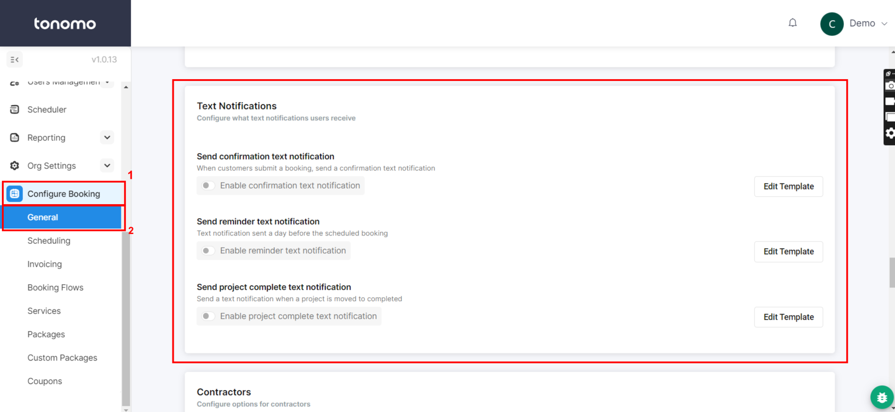

# SMS/Text Message Template

Email is the main form of communication for most companies. However, it is only one part of the overall client interaction experience during the course of a project.

Sending quick texts is a great new way to chat with customers. It helps companies send fast messages about orders and appointments. Text messages get read more than any other form of communication.

To enable this SMS template, you will need to go to **Configure Booking > General** and then scroll down to the Text Notification section.

<figure><figcaption></figcaption></figure>
