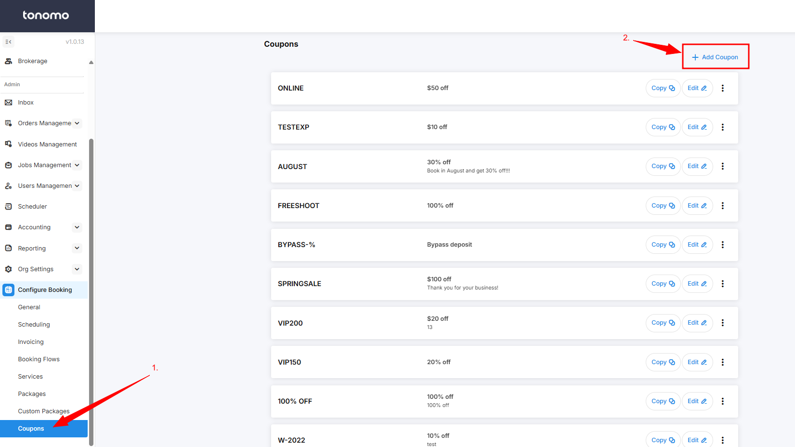

# Coupons

Creating a coupon is a great way to offer discounts or promotions to customers. Whether you’re creating a coupon for a Business, Promo, or Discount, here’s a simple guide to help you make one on Tonomo:

1. Go to **Coupons** under **Configure Booking**.
2. Click on **"+ Add Coupon"** located at the upper right of the webpage.

<figure><figcaption></figcaption></figure>

3. In this section, you can edit the coupon code, type, amount, description, and usage limits.&#x20;

<figure><figcaption></figcaption></figure>


If the "Bypass Deposit" option is enabled, it will automatically bypass the deposit requirement when a customer uses the coupon, even if the booking flow requires a deposit.

