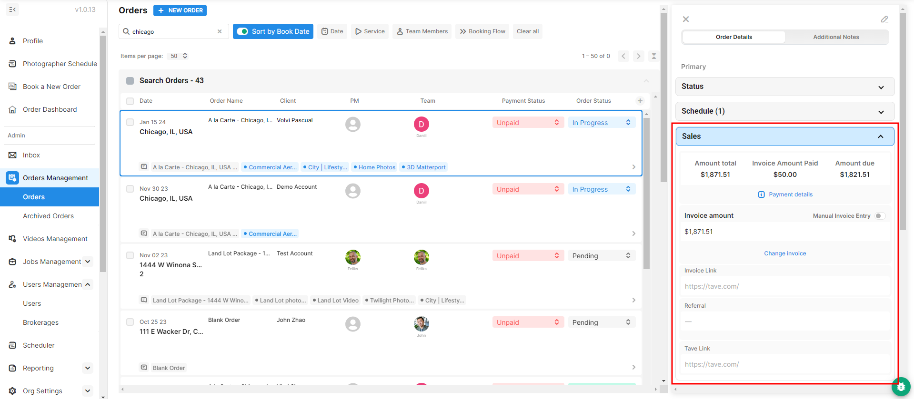
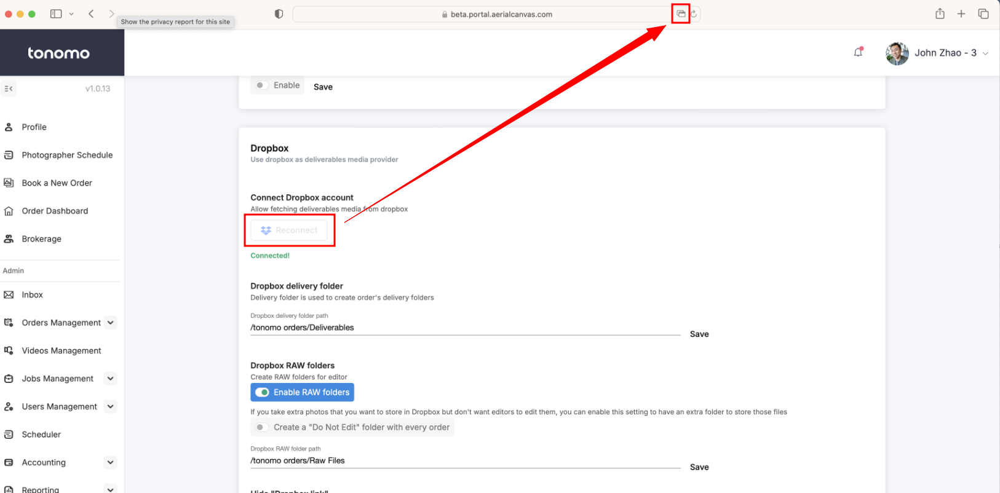

# FAQ

## Why doesn't my service show up?

To add the missing service to your booking page, simply click and drag services from the right-hand bar into a category on the left.

<figure><figcaption></figcaption></figure>

## How to add a custom item to an invoice

To add a custom invoice, click the order to open the **Order Details,** go to the **Sales** section, and select **Change Invoice**. See our [invoicing](../invoicing/sales.md) for more details.

<figure><figcaption></figcaption></figure>

## Why doesn't my add-on show up?

Every add-on service must be tied to a core service. You will have two options to do that.

### First Method

This method allows you to link your add-on services to any core service. Whether it be photography, videography, or any core service within your portal.

You need to edit your add-on service again and enable the "Link add-on to specific services". In order to do that, you need to click **Configure Booking > Services** and then **edit** the add-on services.

<figure><figcaption></figcaption></figure>

You will then see the "Link add-on to specific services" section. Just tag the core service, hit save, and the add-on will appear when the customer chooses that service.

<figure><figcaption></figcaption></figure>

### Second Method

Unlike the first method, where you can link your add-on to any core service, this method will allow you to only link your add-on to a category in the booking flow.

Navigate to **Configure Booking > Booking Flows** and click **Edit.**

<figure><figcaption></figcaption></figure>

Under the services section, you will see your different categories and the services on your right side. You will have to identify your add-on service and drag it into the category you want it to appear in.&#x20;

Example: In the photo below, the add-on service is **2D Layout**. Dragging this add-on to the **Photos** category will link it to any core services under this category.

<figure><figcaption></figcaption></figure>

## How do agents reschedule and cancel their order?

Agents who have successfully booked an order will promptly receive a detailed email containing their order status. This email provides them with convenient options to either reschedule or cancel their order. Additionally, the email includes comprehensive information encompassing booked services and packages, property details, and the associated invoice, ensuring a comprehensive overview of their transaction.

<figure><figcaption>
Order Status Preview
</figcaption></figure>

To activate this functionality, please see this [documentation](../scheduling/scheduling-configuration/allow-customers-to-reschedule-and-cancel-on-their-own.md).


You won’t be charged by tonomo for cancelled and archived orders.


## What are the different ways to create an order?

You can book with us using four different methods:

### [Book a new order](../order-management/creating-orders-for-your-customers.md#booking-flow-method)&#x20;

This method is the recommended way to book because it works with all the automation that we have within Tonomo and ensures that the order is booked with all the required fields.

### [Creating new orders through the scheduler](../order-management/creating-orders-for-your-customers.md#scheduler-method)

This method allows you to book directly on a photographer's calendar. This offers more flexibility in terms of scheduling than using the booking flow. There are fewer options and distractions like thumbnails and descriptions.

### [Reserving timeslot through the scheduler](../order-management/creating-orders-for-your-customers.md#reserved-time-slot)

This method creates a hold on a photographer's calendar. You can use this method to reserve a slot for a customer's order when you know the time and date they want, but not the property details.

### [Create a blank order - Manual Method](../order-management/creating-orders-for-your-customers.md#manual-method)

We do not recommend booking through this method for real estate listings. This will allow you to create a new blank order in the Pending section without filling out any required fields. You can use this method to track one off custom projects or work that is not directly related to real estate listings. Since we don't enforce all the required fields, some automations might not work. You will then have to fill out everything, from the Customer's Name to the Invoice Amount.

## Why am I not receiving the calendar invite for my shoot?

It should appear automatically. However, if you haven’t had any exchanges with the event sender, google will not add it the first time.\
For more details, please see this: [https://knowledge.hubspot.com/automatically-create-meetings-on-a-google-calendar](https://knowledge.hubspot.com/automatically-create-meetings-on-a-google-calendar)


You can also view the documentation when your calendar invite is being marked as spam.


## How do I reconnect/change my Dropbox account?

This can be easily done on the portal. Head over to **Configure Booking > General**, navigate through Dropbox, and click "Reconnect".


Please make sure you are signed in to the correct Dropbox account before clicking "Reconnect".


<figure><figcaption></figcaption></figure>

If you're on a **Mac** and using **Safari**, you might not be redirected to the Dropbox page after clicking **"Reconnect"** due to the pop-up blocker. If this happens, look for an icon in the website address bar (please see the screenshot below). Just click it to continue connecting your Dropbox account.

<figure><figcaption>
Pop-up icon
</figcaption></figure>

## How do I import users to Tonomo?

If you need help importing users, please reach out to Tonomo Support on Slack. Just make sure you have a CSV file ready with your list of users.

## Will the text message be scheduled along with the completion email when I set the schedule?

Yes! The text messages support the “Send Later” feature as well.

<figure><figcaption></figcaption></figure>

## How to create a password for an agent account?

Creating a password for your agent only works if they log in using a phone number. If they use an existing password or log in with an email, they will need to reset their password and create a new one.

Here are the steps to create a password:

1. Go to your login page.
2. Enter the email and password.
3. Click "Register with email."

<figure><figcaption></figcaption></figure>
