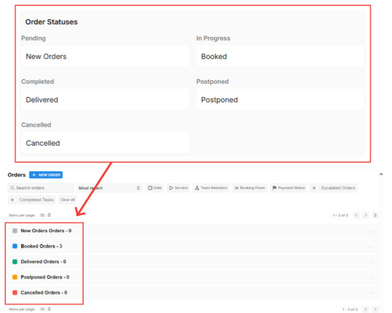
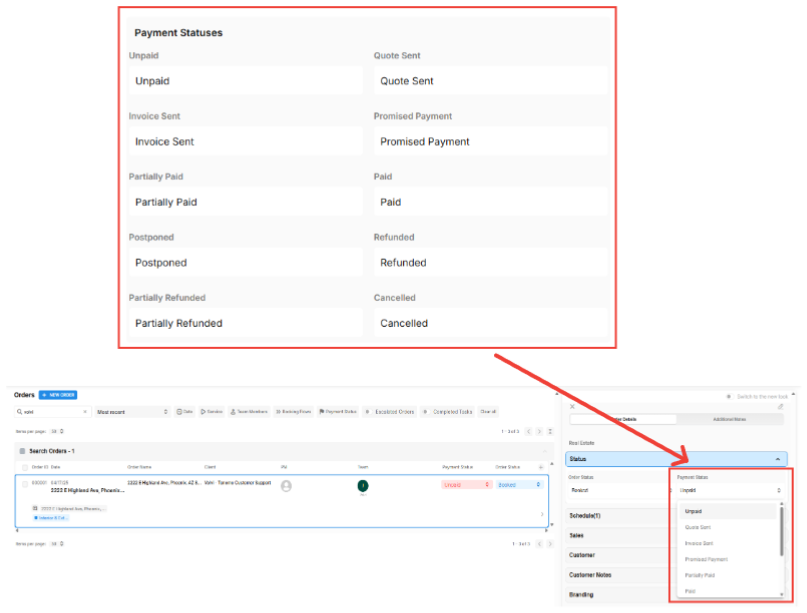
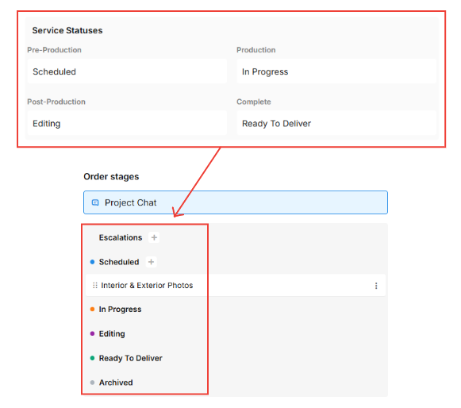
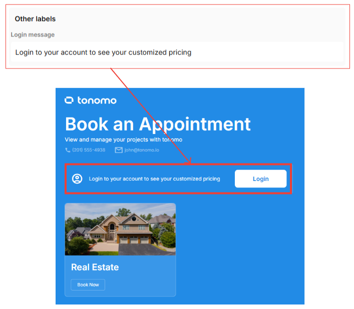

# Customization

On this page, you can edit various statuses and labels within your portal. This allows you to customize and streamline your workflow to better match your processes and preferences. You can find this section by going to **Org Settings > Customization**.

## Order Statuses

Order Statuses allow you to rename statuses to better fit your workflow. These labels appear on the Orders Management page. While you can change the name of a status, its function will remain the same. For example, renaming the "Postponed" status to "Complete Order" will still postpone the order—the behavior does not change.

<figure><figcaption></figcaption></figure>

## Payment Statuses

Just like order statuses, you can also rename the **payment statuses** in your portal. While the behavior remains the same, customizing the labels allows you to better align them with your workflow.

<figure><figcaption></figcaption></figure>

## Service Statuses

You can also edit the **status of your services** to better organize and tailor them to your workflow. This allows you to rename statuses to something more relevant or intuitive for your team. These service statuses are visible within the **Project Chat** section.

<figure><figcaption></figcaption></figure>

## Other labels

This label appears on the login page. You can edit the text to make it more relevant for your agents—especially if they have assigned booking flows that won’t be visible unless they’re logged in.

<figure><figcaption></figcaption></figure>

## Orders Management

Once this feature is enabled, a new section called **“Unscheduled Orders”** will appear above the order statuses on your **Orders Management** page. All orders that haven’t been scheduled will be listed here, and any order that gets scheduled will automatically be removed from the list. This feature helps you easily track and manage unscheduled orders in one centralized place.&#x20;

<figure><figcaption></figcaption></figure>
