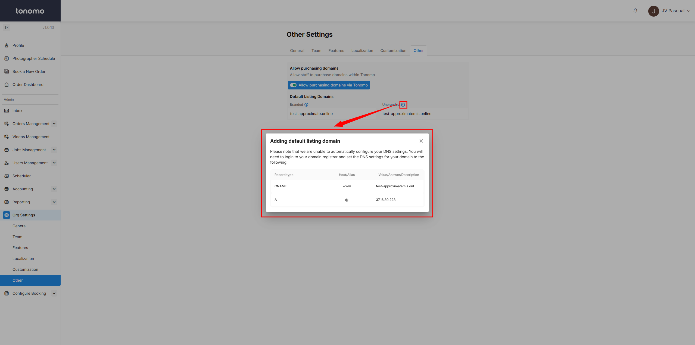

# Domain Settings

## Allow purchasing domains

Turn on this feature to let your admins purchase a **custom domain** for an order. With this option, you can buy a domain directly through Tonomo instead of using an external web hosting service. This makes the process faster, easier, and more convenient. Your custom domain will be linked seamlessly to your portal.

<figure><figcaption>
Allow purchasing domains
</figcaption></figure>

## Default Listing Domains

In addition to your default listing domains, like **listings.domain.com** or **properties.domain.com**, you can set a different domain for your **branded** and **unbranded** listings. This is especially useful for **MLS listings**, which often require "mls" in the domain for unbranded versions. With this feature, you can easily meet MLS requirements while maintaining a professional and flexible setup. It helps keep your listings organized and ensures compliance with industry standards.

<figure><figcaption>
Default Listing Domains
</figcaption></figure>

Here’s how to add a custom listing domain for your **unbranded listings**:

1. Get a domain that includes "mls." For example, if your default domain is `tonomo.io`, you’ll need to purchase `tonomomls.io`.
2. Add your new domain under the **Unbranded** section. It should look like `listings.tonomomls.io` or `properties.tonomomls.io`.
3. Click the info icon, and a popup will show an **A record**. Add this to your DNS records to white-label your listing page.

Once done, all your **unbranded listings** will automatically update to use your new domain.

<figure><figcaption>
Custom Unbranded Domain
</figcaption></figure>
