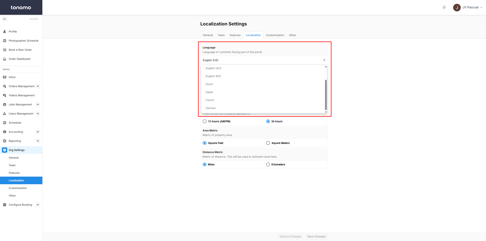
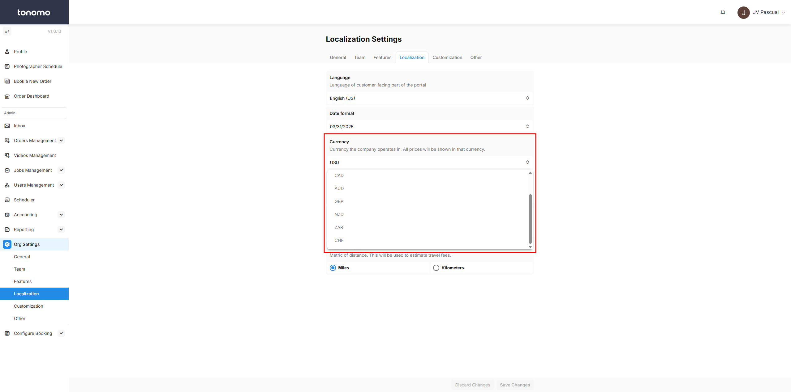

# Localization Settings

## Language

Tonomo lets users customize their language settings to match their needs. It supports **Dutch, Italian, French, German**, and **different types of English**. This makes it easier for real estate professionals and photographers to work with clients in different countries. Users can switch languages anytime, keeping things simple and accessible.

<figure><figcaption>
Language
</figcaption></figure>

## Date Format

Tonomo lets you choose the date format that works best for you. You can pick between **dd/mm/yyyy** or **mm/dd/yyyy**, depending on what you're used to. This makes it easier to read and enter dates without confusion. The setting is simple to change, so you can adjust it anytime.

<figure><figcaption>
Date Format
</figcaption></figure>

## Currency

Tonomo makes it easy to choose the currency you work with. You can select from options like USD, EUR, CAD, AUD, and more. Once set, your chosen currency will be reflected across your portal. This helps keep pricing and transactions clear for you and your clients.

<figure><figcaption>
Currency
</figcaption></figure>

## Time Format

Tonomo lets you choose the time format that suits you best. You can switch between the **24-hour format** or the **12-hour format** with AM and PM. This makes it easier to read and schedule appointments the way you're used to.

<figure><figcaption>
Time Format
</figcaption></figure>

## Area & Distance Metric

Tonomo lets you set up your portal with the right area and distance units. You can choose between **square feet or square meters** for area measurements and **miles or kilometers** for distance. This helps ensure accuracy and consistency based on your region.

<figure><figcaption>
Area &#x26; Distance Metric
</figcaption></figure>

