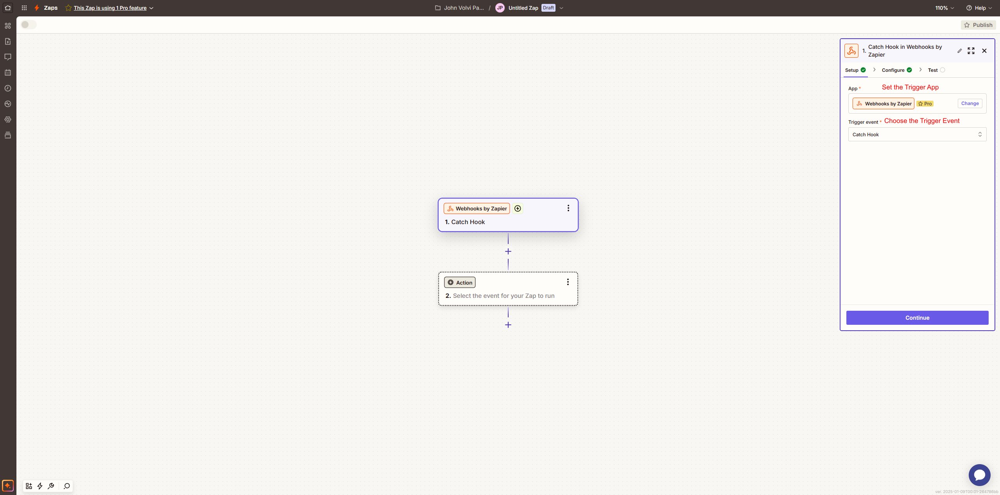
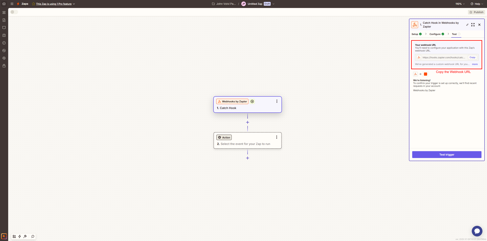
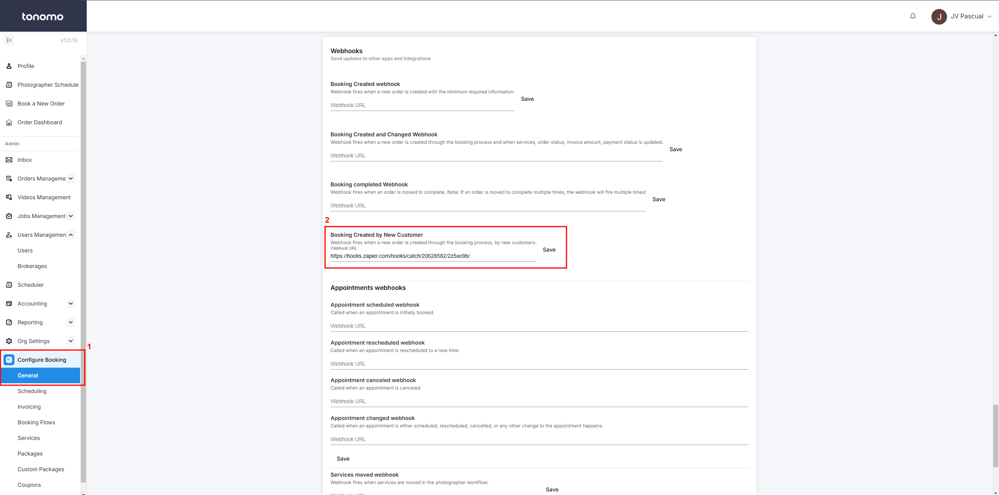
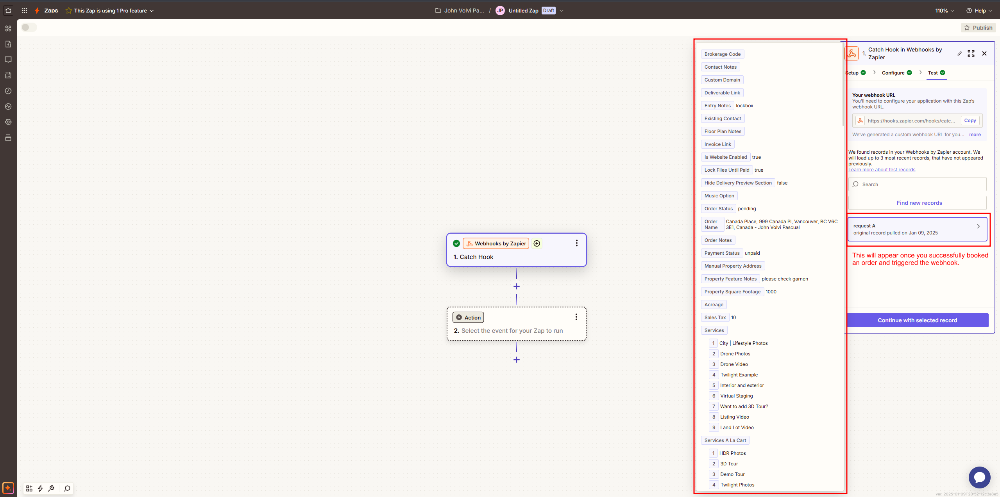
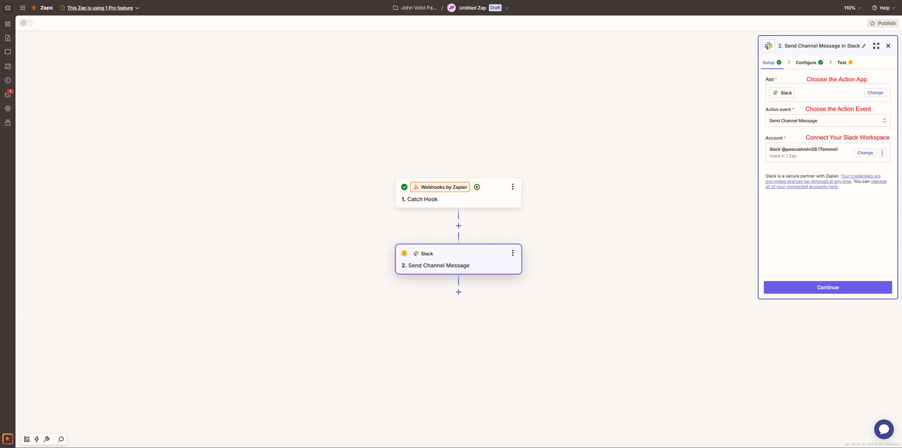
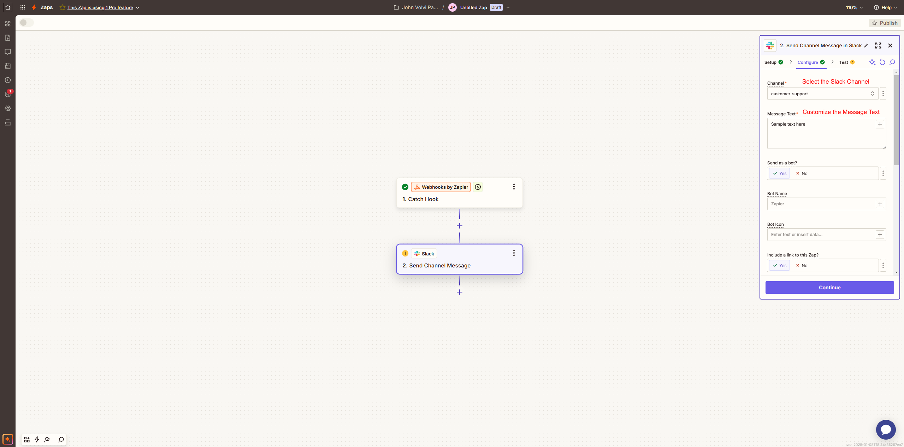

# Slack Automation

Connect Slack to Tonomo via Zapier to automatically send a message to your team whenever a client books a new order or updates an existing one. Using Webhooks, Tonomo triggers Zapier to forward these updates to a designated Slack channel, ensuring your team stays informed about new bookings or changes in real-time. This automation helps streamline communication and keeps everyone on the same page.

## Step 1: Create a Webhook in Zapier

* **Log in to Zapier**:
  * Go to [Zapier](https://zapier.com) and log into your account.
* **Start a New Zap**:
  * Click the **“Create Zap”** button.
* **Set the Trigger App**:
  * Search for and select **“Webhooks by Zapier”** as the trigger app.
* **Choose the Trigger Event**:
  * Select **“Catch Hook”** and click **Continue**.
* **Copy the Webhook URL**:
  * After setting up the trigger, Zapier will provide a unique **Webhook URL**. Copy this URL—you’ll use it on your portal.

<figure><figcaption>
<strong>Set the Trigger App and Choose the Trigger Event</strong>
</figcaption></figure>

<figure><figcaption>
<strong>Copy the Webhook URL</strong>
</figcaption></figure>

## **Step 2: Set Up tonomo.io to Send Data to the Webhook**

* **Log in to tonomo.io**:
  * Go to your tonomo portal https://portal.\{{COMAPANY-DOMAIN\}}.
* **Access the Webhook Section**:
  * Navigate to the Webhook section under **“Configure Booking > General”** section.
* **Paste Webhook URL**:
  * Paste the **Zapier Webhook URL** into the designated field.
    * There are different fields on tonomo where you can use this. For example Booking Created webhook, Booking Created by New Customer, Appointment scheduled webhook, etc.
* **Test the Webhook**:
  * Trigger an event in tonomo.io that matches the webhook's criteria (e.g., create a test booking).
    * To test, create an order with dummy customer contact information (Don't just leave stuff blank, create an order as if it was real).&#x20;
  * Jump back into Zapier and click **Test Trigger.** The test order can take up to a couple minutes to come through, so give it a few tries.
    * If it's successful, you will see the fields you can use for the message text!&#x20;
    * If it's not, double check your URL you pasted to Tonomo matches the one Zapier provided. Then reach out to your support person if the issue persists.

<figure><figcaption>
<strong>Paste Webhook URL</strong>
</figcaption></figure>

<figure><figcaption>
<strong>Test the Webhook</strong>
</figcaption></figure>

## **Step 3: Set Up Slack as the Action in Zapier**

* **Choose the Action App**:
  * In Zapier, search for and select **“Slack”** as the action app.
* **Choose the Action Event**:
  * Select **“Send Channel Message”** and click **Continue**.
* **Connect Your Slack Workspace**:
  * Authenticate your Slack account and grant permissions.
* **Select the Slack Channel**:
  * Choose the specific channel where the messages will be sent.
* **Customize the Message Text**:
  * Include any suitable message that you want and replace placeholders (e.g., \{{{property\_address.formatted\_address\}}}) with the actual fields from the webhook payload.

<figure><figcaption>
Choo<strong>se the Action App</strong>
</figcaption></figure>

<figure><figcaption>
S<strong>elect the Slack Channel and Customize the Message Text</strong>
</figcaption></figure>
