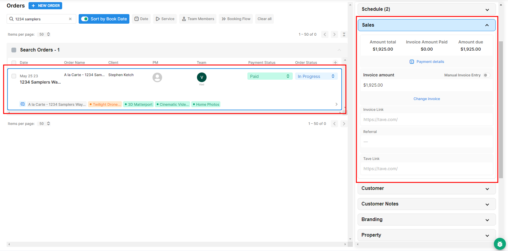
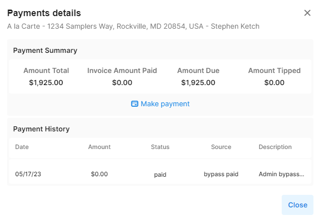
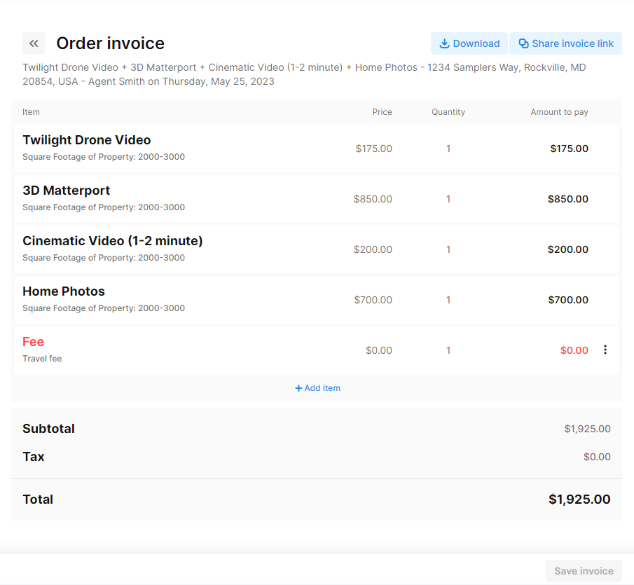
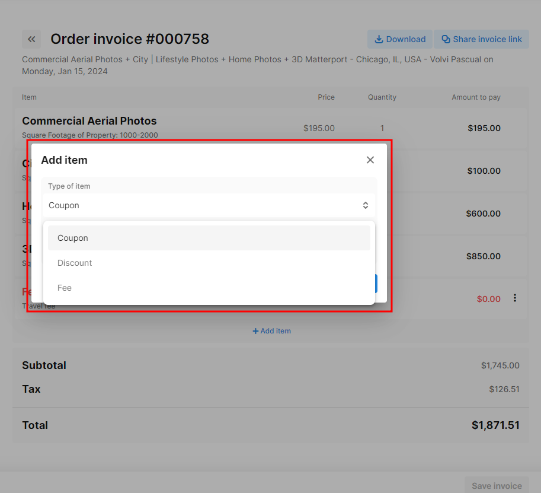

# Sales


To fully utilize our Invoicing features, you both need to have [Payment settings](https://docs.getautonomo.com/payments) for the account-wide level turned on as well as settings for each [Booking Flow](https://docs.getautonomo.com/services-and-packages/booking-flows#payment-settings).


Invoicing features per order can be found on the right hand side of each order under the Order Details panel in Order Management.

<figure><figcaption></figcaption></figure>

By clicking **Payment details**, you can see a record of all previous successful and unsuccessful payment attempts. This can be helpful in troubleshooting why a payment failed.

From here, you have also **Make Payment**. If you have the [Hold Credit Card ](https://docs.getautonomo.com/services-and-packages/booking-flows#payment-settings)feature turned on for this Booking Flow, this is where you'll be able to find the customer's CC to charge. Alternatively, you can also record a cash/check payment to unlock the files for the customer.

<figure><figcaption></figcaption></figure>

In addition, you also have access to the invoice via the **Change Invoice** button.

<figure><figcaption></figcaption></figure>

From here, you can download the invoice, send the customer a link, or click **+ Add item** to add any appropriate fees, discounts, or coupons.\

You have the flexibility to enhance your invoice by incorporating three distinct items: **Coupons**, **Discounts**, and **Fees**.

* **Coupons:** Easily incorporate existing coupons or generate new ones tailored to your customers.
* **Discounts:** Provide flexibility with flat-rate or percentage-based discount options for your customers.
* **Fees:** Unlock the ability to create various fees—whether percentage-based, flat rates, or transaction fees. Additionally, you can establish specific fees like travel fees. Enhance clarity by adding a brief description for agents to understand each item thoroughly.

<figure><figcaption></figcaption></figure>

\
When you're done, make sure to click **Save Invoice** at the bottom right. The customer will see the changes the next time they visit their invoice page or refresh their page.
