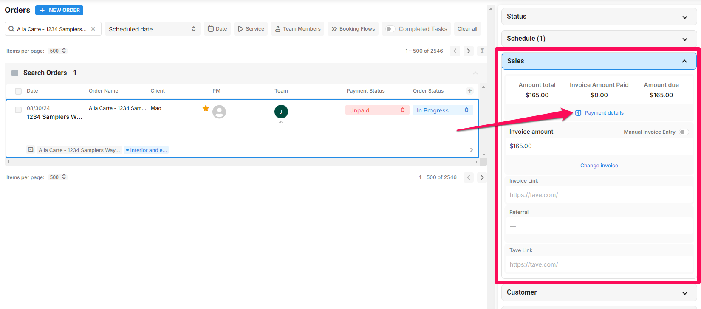
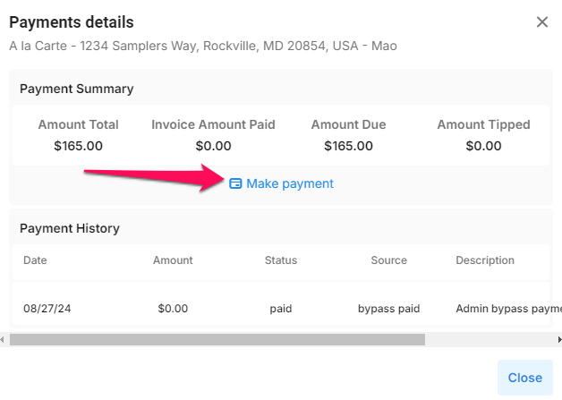
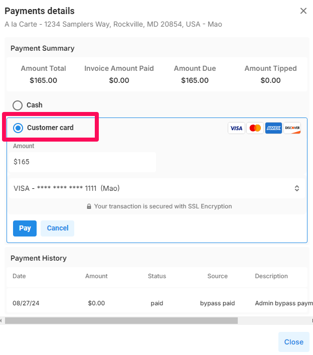
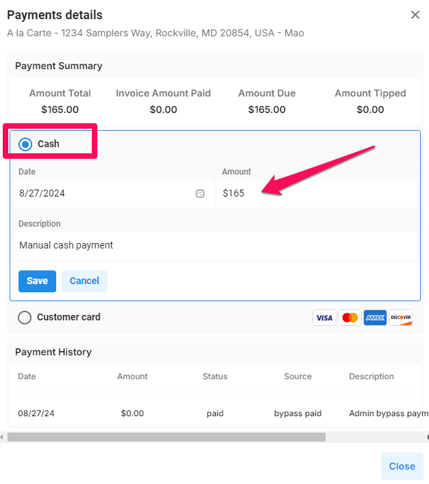
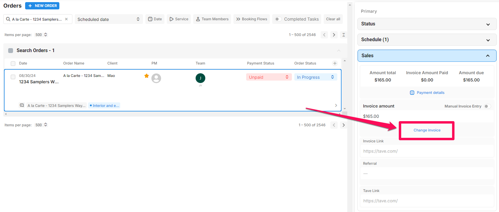
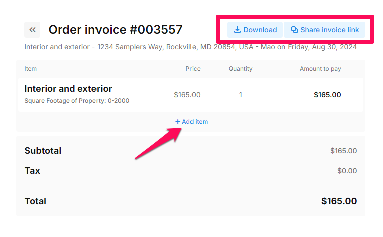
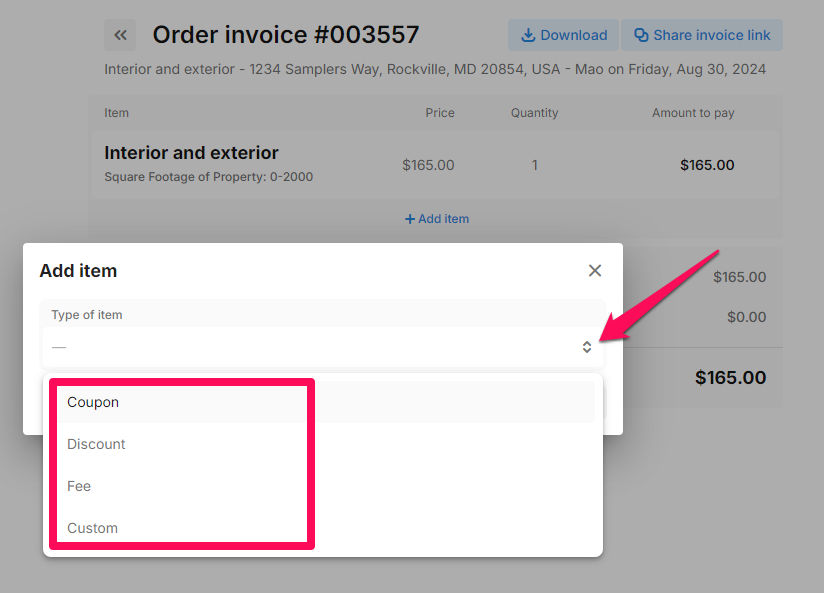
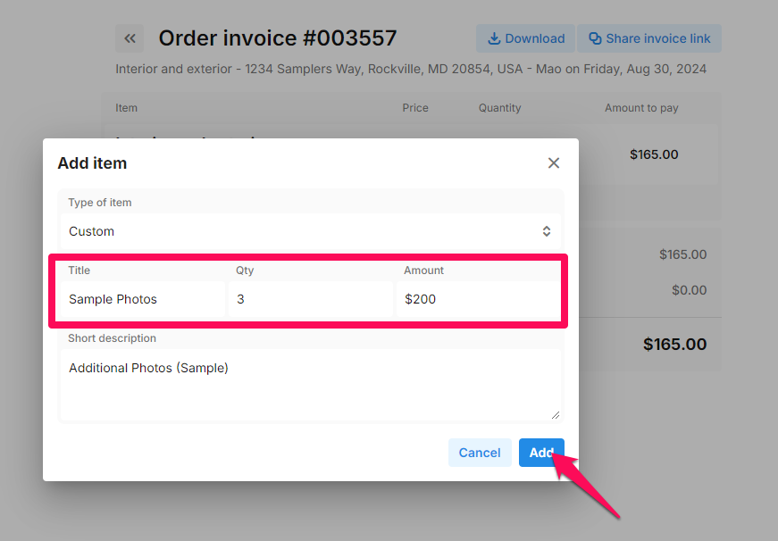
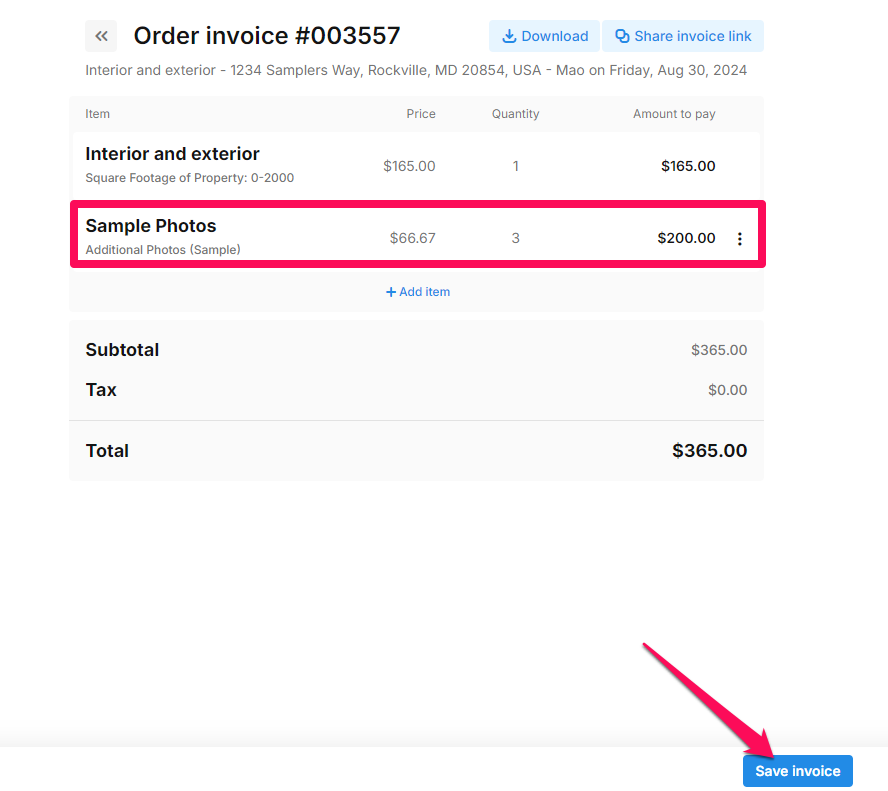

# Sales


To fully utilize our Invoicing features, you both need to have [Payment settings](https://docs.getautonomo.com/payments) for the account-wide level turned on as well as settings for each [Booking Flow](https://docs.getautonomo.com/services-and-packages/booking-flows#payment-settings).


Invoicing features per order can be found on the right-hand side of each order under the Order Details panel in Order Management.

By clicking **Payment details**, you can see a record of all previous successful and unsuccessful payment attempts. This can be helpful in troubleshooting why a payment failed.

<figure><figcaption></figcaption></figure>

From here, you can also **Make a Payment**.

<figure><figcaption></figcaption></figure>

When logged in, the customer’s credit card will be automatically stored in the system after a payment is made, allowing you to charge their invoice without needing to re-enter payment details.

<figure><figcaption></figcaption></figure>

You can also record a cash/check payment to unlock the files for the customer by clicking the "Cash" button. Also, the description can be changed.

<figure><figcaption></figcaption></figure>

In addition, you can access the invoice via the **Change Invoice** button.

<figure><figcaption></figcaption></figure>

From here, you can download the invoice, send the customer a link, or click **+ Add item** to add any appropriate fees, discounts, coupons, and custom items.

<figure><figcaption></figcaption></figure>

You have the flexibility to enhance your invoice by incorporating three distinct items: **Coupons**, **Discounts**, **Fees, and Customized fees**.

* **Coupons:** Easily incorporate existing coupons or generate new ones tailored to your customers.
* **Discounts:** Provide flexibility with flat-rate or percentage-based discount options for your customers.
* **Fees:** Unlock the ability to create various fees—whether percentage-based, flat rates, or transaction fees. Additionally, you can establish specific fees like travel fees. Enhance clarity by adding a brief description for agents to understand each item thoroughly.
* **Custom Items**: Ability to create a specific fee that allows you to edit the title, quantity, amount, and description.

<figure><figcaption></figcaption></figure>

For example below, we choose "Custom".

<figure><figcaption></figcaption></figure>

When you're done, make sure to click **Save Invoice** at the bottom right. The customer will see the changes the next time they visit their invoice page or refresh their page.

<figure><figcaption></figcaption></figure>
