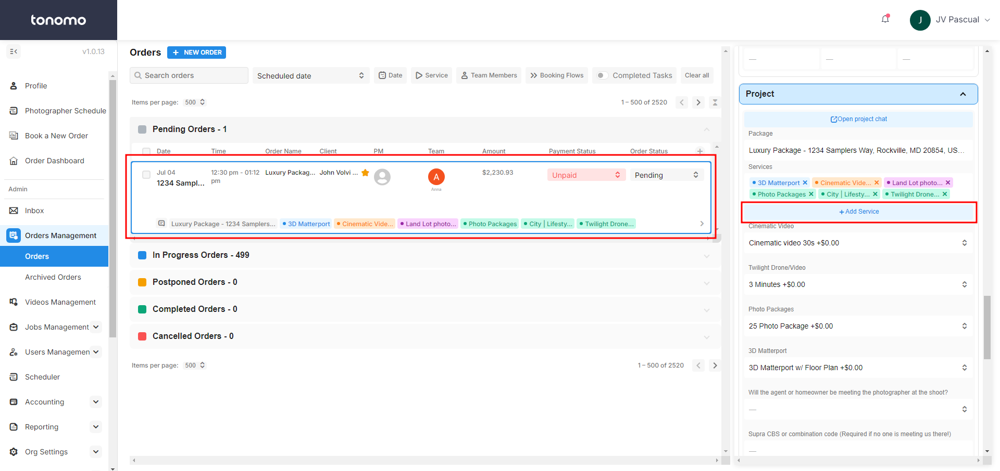
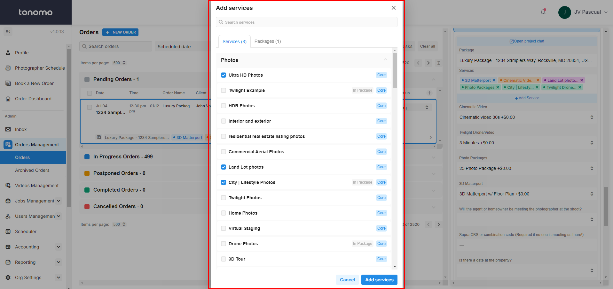
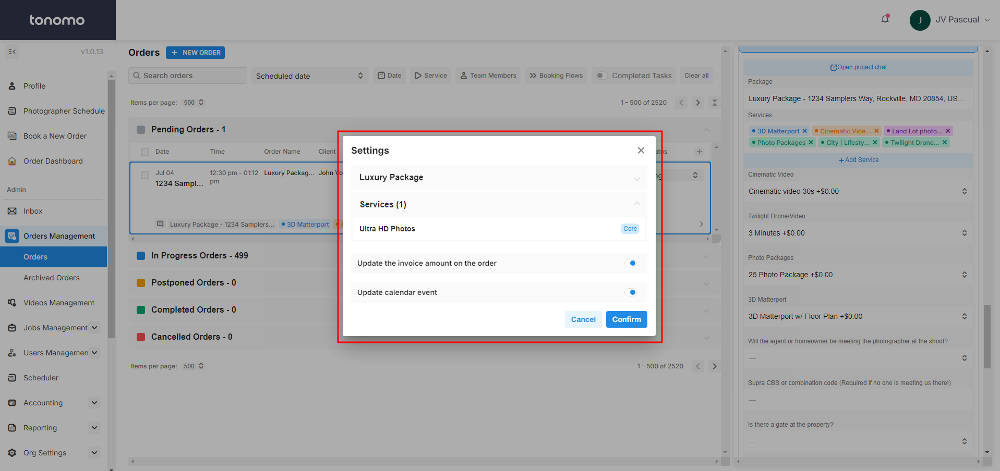

# Adding Services After Booking

This article will guide you through adding a Service to an order after the customer has already booked.

**Access Orders:** Go to _Order Management > Orders_ and click the date or Order Name.

<figure><figcaption></figcaption></figure>

**Add a Service:** In the Order Details panel on the right, click the **+ Add Service** button. You will see a list of Services and Packages that you can scroll through or search. Then, check the Service/Package you want to add, then click **Add Services**.

<figure><figcaption></figcaption></figure>

**Confirmation:** On the confirmation page, indicate if the invoice amount should be updated for the order. Additionally, you can choose to update the calendar event with the new Service. Finally, click **Confirm**.

<figure><figcaption></figcaption></figure>


Tonomo will automatically update the length of the shoot as long as the "**Update Calendar Event**" toggle is turned on.

