# Booking Orders

## Customers Booking for Themselves

Feel free to share this [walkthrough ](https://youtu.be/9tNQ9qcYkrE)of how they can book themselves.

## Booking Orders for your Customers

There are three methods for creating orders for your customers. There are a couple things to consider as each method has it's own uses.

First, you can book orders for your customers from the regular [Booking Flow](creating-orders-for-your-customers.md#booking-flow-method). This allows the system to calculate the amount of time your staff will need for the shoot based on the [Schedule Time](../services-and-packages/services.md#adding-services) you entered when creating your Services and Packages. The system will also assign the order according to your scheduling settings like Service Zones, Skillsets, and Availability.

Second, you can directly via your Scheduler, allowing you to book orders quickly and overriding some rules and automations.

Third, you can book [Manually](creating-orders-for-your-customers.md#manual-method). This is useful if you want to override some system automations. Through this method you manually set the photographer assigned to the order and other options.

However, while there are options, almost all orders should be created through the [Booking Flow Method](creating-orders-for-your-customers.md#booking-flow-method) or [Scheduler ](creating-orders-for-your-customers.md#schedule-method)methods.

### Booking Flow Method

First, click the Book a New Order button in the top left then select the booking flow. This is the same button your customers click when they order.&#x20;

<figure>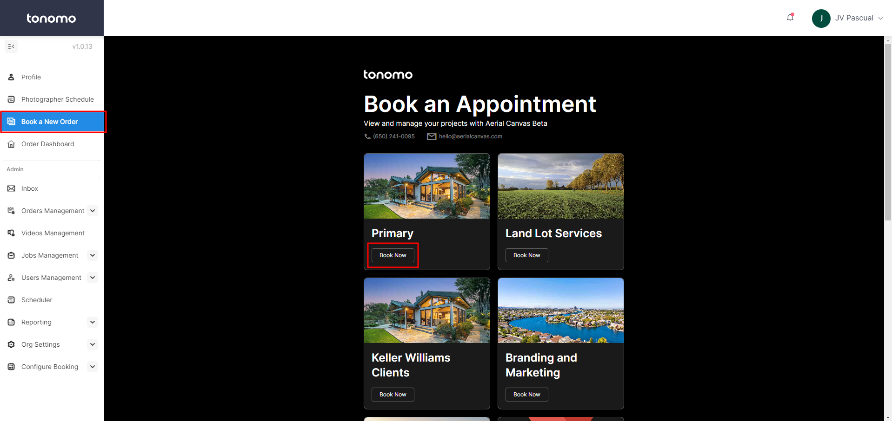<figcaption></figcaption></figure>

Next, Enter a Property Address, Total Square Footage, and click **Confirm**.

<figure>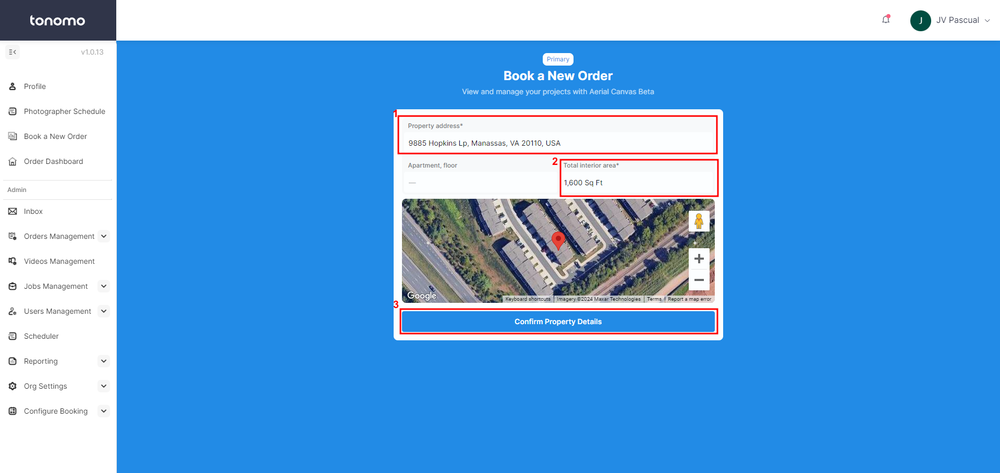<figcaption></figcaption></figure>

Select the Services or Packages the customer wants and click **Continue to details**.

<figure>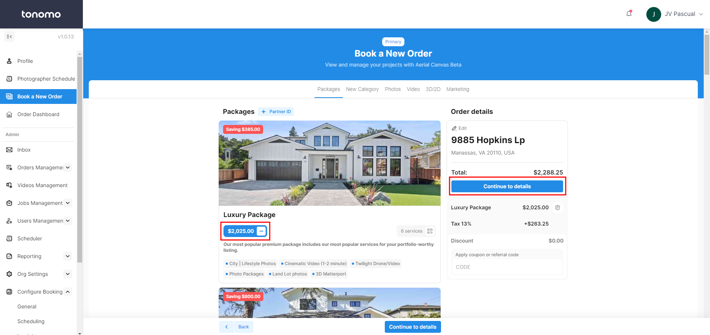<figcaption></figcaption></figure>

On the next page, Select any tiers, and answer any questions. Click **Continue**.

<figure>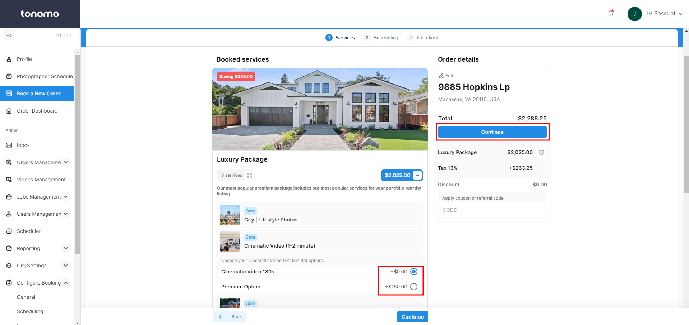<figcaption></figcaption></figure>

Add-Ons will pop up, add as many as needed then click **Add**.

<figure>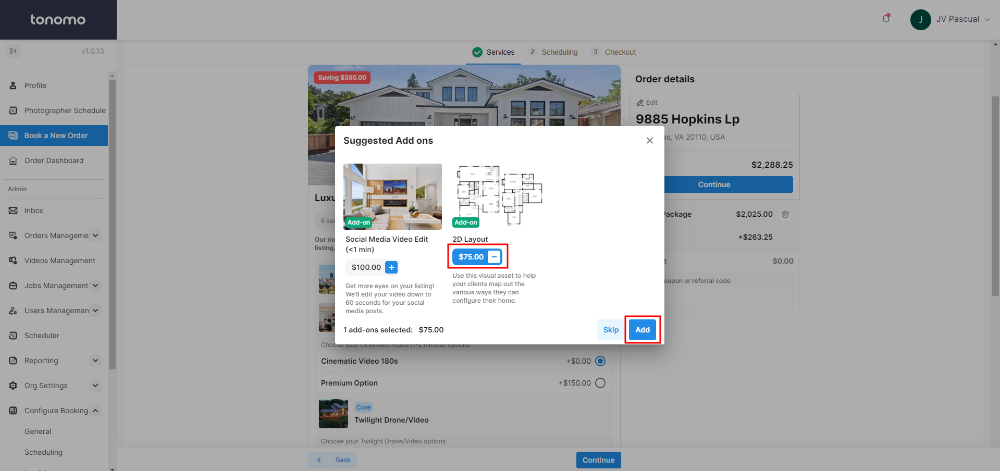<figcaption></figcaption></figure>

You can assign this order to a specific Photographer because you are logged in as an Admin. This feature is also available for each booking flow.

Select the date and time for the order as well as any final questions and then **Continue.**

<figure>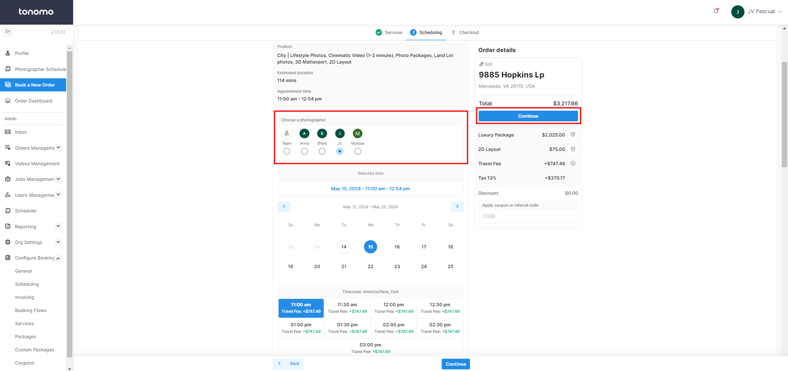<figcaption></figcaption></figure>


_Only qualified photographers to take on the project will appear in this section. That is based on availability, skillset, and service area._


Next, use **I'm placing a booking for a new agent,** filling out the customer details, and selecting the correct **Listing Agent & Branding**.

<figure><figcaption></figcaption></figure>

Alternatively, **I'm placing a booking for an existing agent** can be used to avoid filling up the agent information when they already have a tonomo account.

<figure>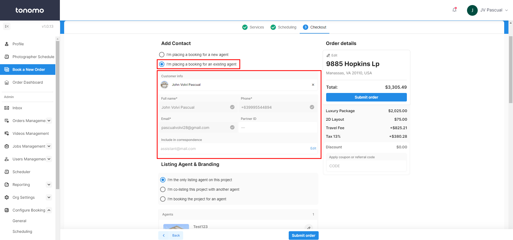<figcaption></figcaption></figure>

Finally, there are a few toggles available to you because you are creating this order as an Admin. Your customers will not see these options.

You may enter payment details or skip it. You may also suppress confirmation emails or texts and calendar invites (if you're just testing an order).

Click the **Terms of Service** box and **Submit Order**.

<figure>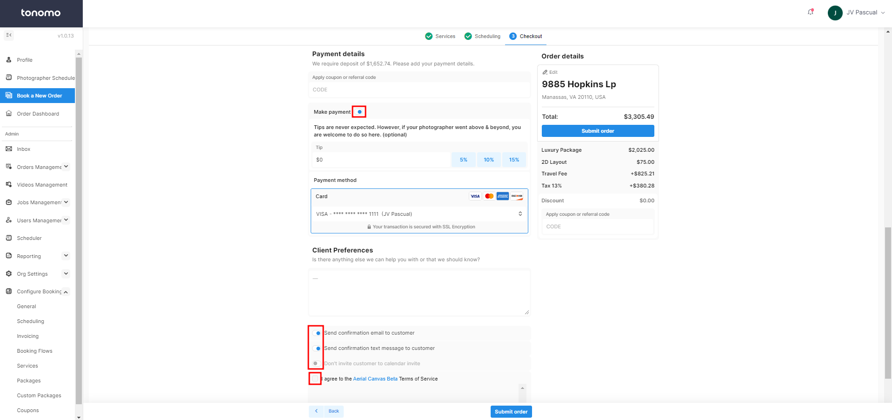<figcaption></figcaption></figure>

### Scheduler Method

The second method to create orders for your customers is through your Scheduler. This method allows you to book with a streamlined booking flow. There are fewer options and distractions like thumbnails and descriptions. To get started, click the **Scheduler** button on your left panel and then **+ Create** in the top left corner.

<figure><figcaption></figcaption></figure>

Next, click **+ Create a New Order**.

<figure>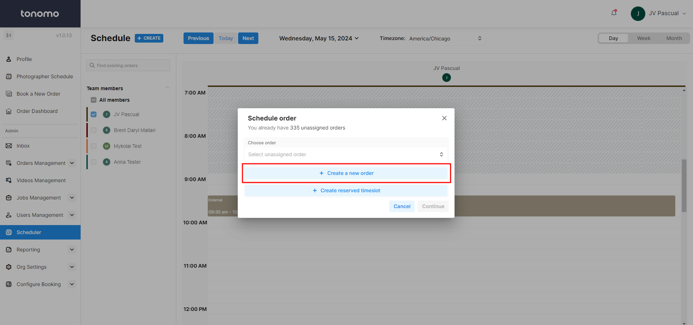<figcaption></figcaption></figure>

The order can be placed for a new customer or search for an existing customer. Enter their contact details if needed. Finally, select the **Booking Flow** this order should be assigned to.

<figure>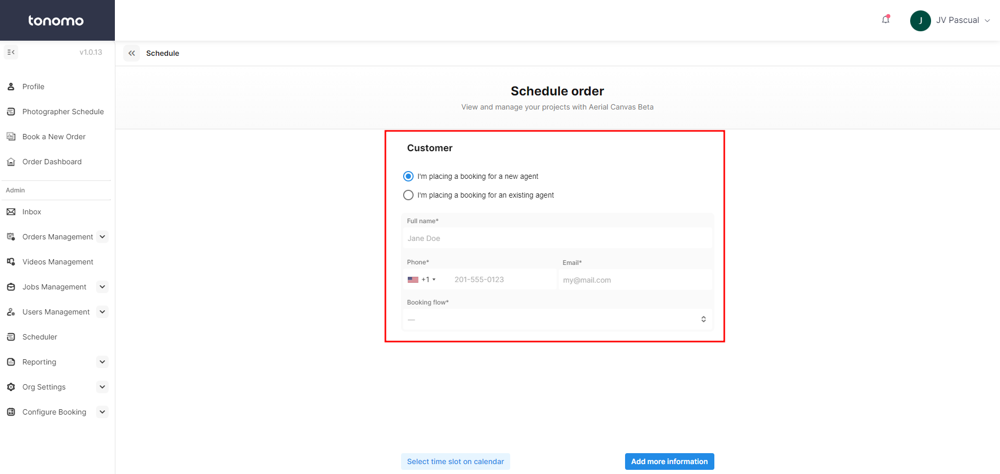<figcaption></figcaption></figure>


This method assumes that the contact information you enter is the one and only Booking Agent for the order. If you need to change that or add more, book through the [Booking Flow Method](creating-orders-for-your-customers.md#booking-flow-method)


Go through the booking; select the **Location**, **Packages**, or **Services**, and answer any questions assigned to the **Booking Flow.**

Finally, you'll select the time slot. This works differently than the standard **Booking Flow Method.**

<figure>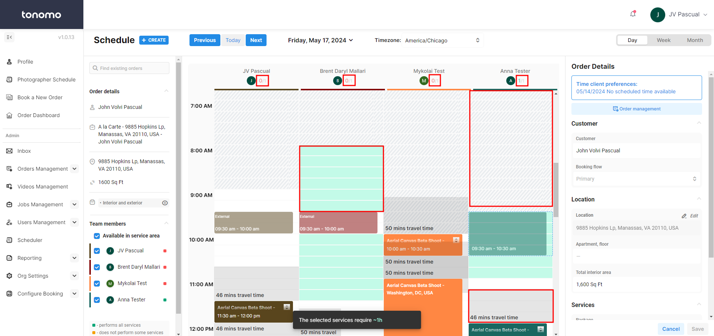<figcaption></figcaption></figure>

First, you're able to see which Photographer has the skillsets available to complete the shoot with the little "0/1" or "1/1" indicators at the top of the image above.

Next, you can see where a photographer is not scheduled to be working with the gray hash marks. This also indicates the travel time needed from the current event to another.

Finally, the Green sections indicate where the photographer is both available and has the drive time required to get to the appointment.\
\
However, you can manually override any of this, assigning the order to someone without the skills and/or is unavailable.


If you just want to add an order to your system, but NOT assign a calendar event, you can skip the next steps by clicking Cancel in the bottom right when it asks you to set an appointment.


#### Why Schedule Method

This method allows you to manually override scheduling rules like skillsets and availability. It also provides a more streamlined book experience for the Staff member to more quickly book.

### Manual Method


We typically do not recommend booking through this method. If you find yourself booking lots of orders Manually, reach out to Tonomo support.


You may also create orders through the **+ New Order** button on the Order Management page.

<figure>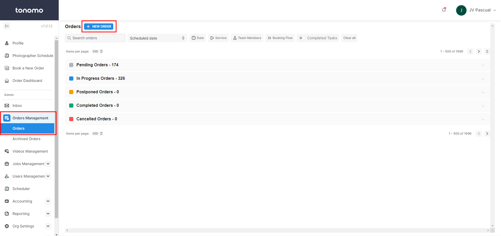<figcaption></figcaption></figure>

Once you click the button, you will need to add the customer details or search for an existing one, and select the desired booking flow. We then create a new blank order in the Pending section with no details. You will then have to fill out all the property details, add services and packages, schedule, etc.

<figure><figcaption></figcaption></figure>

#### Why Manual Method

In some cases you may just need to get an order into the system and you don't care about the normal restrictions. For example, you may want to create an order for a weekend when you normally don't.

Use this method when you don't want the usual restrictions on an order to be enforced like:

* Pay-Before-Delivery (customers will be able to get their assets without paying)
* Deposit
* Service Areas
* Skillsets
* Invoice Amount

All of these will not be options for orders created through the Manual Method. Due to the chance for human error, the Manual Method should be used as an _exception_ and not a rule. If you find  yourself creating a lot of Manual orders, please reach out to Tonomo support as there may be a feature that can assist you.

### Reserved Time Slot

The Reserved Time Slot feature allows you to secure a specific date and time for a customer's order, even if you don't yet have the property details. Here's how to use it:

1.  **Create a Reserved Time Slot**

    * In the scheduler, click **+ Create** in the top left corner.
    * In the popup menu, select **+ Create Reserved Time Slot**.

    <figure><figcaption></figcaption></figure>
2.  **Assign the Time Slot**

    * On the calendar, choose the **desired date, time, and photographer** for the future order.
    * You can **add or edit details**, such as notes explaining why the time slot was reserved.

    <figure><figcaption></figcaption></figure>
3.  **Convert the Reservation to an Order**

    * When ready to proceed, click on the reserved event and select **Go to Booking**. This will take you to the booking flow with the reserved time slot automatically set as the appointment time on the scheduling page.

    <figure><figcaption></figcaption></figure>

    * **Change Booking Flow**: If needed, you can switch the booking flow at this step to redirect to a different flow when you click **Go to Booking**.
4.  **Optional: Convert to a Blank Order**

    * You can also convert the reserved time slot into a blank order.

    <figure><figcaption></figcaption></figure>

    * **Note**: Once converted to a blank order, the option to go to the booking page will no longer be available. You'll need to manually enter the order details


After clicking Go To Booking, you can send the URL that opens to the Agent and they can complete the booking themselves.


## Delivery-Only Orders

Early on in using Tonomo, you may decide to start using the platform to deliver orders, but not receive orders. We support creating orders manually for your customers and then just delivering through Tonomo. This way, you and your customers start getting a softer introduction to the change so that you don't have to do everything at once.

### Setup Dropbox

1\) Click **Configure Booking** > **General**

2\) Scroll down and click the **Dropbox** button to connect your Dropbox account.

3\) Enter a root folder URL and click **Save**. This will be where Tonomo creates folders for all of your Agents and Orders. It should be called something like "Tonomo Orders"

<figure>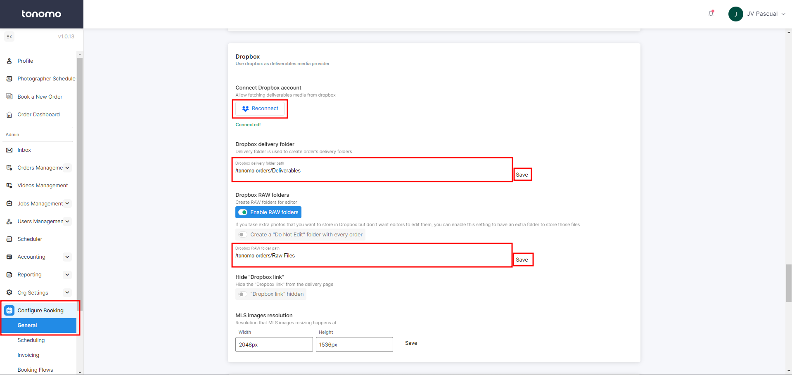<figcaption></figcaption></figure>


Enabling RAW Folders allows you to have separate folders to upload RAW files for your editors.


### Create and Deliver Orders

Until your onboarding is complete, booking orders through the normal flow will not work quite right. In the meantime, you can use our admin-override tool for creating orders that you just intend to use for delivery. These orders won't appear in your or your customer's calendars, they're just about getting them their assets in a formatted, consistent way.

1\) Go to **Order Management** > **Orders** and click **+ New Order.** Please see [Manual Method](creating-orders-for-your-customers.md#manual-method) documentation for more details.

This will create a Blank Order and open our Order Details panel on the right. Before you can deliver your order you need to add some information. We will be skipping most fields as they aren't necessary for delivery-only orders.

<figure><figcaption></figcaption></figure>

2\) Under the **Branding** section, click the pencil icon to edit the customer details. Fill out the profile photo, brokerage logo, name, brokerage, phone, and email. Click **Add Agent**.

<figure><figcaption></figcaption></figure>

3\) Scroll down and enter the Property Address and Square Footage

<figure>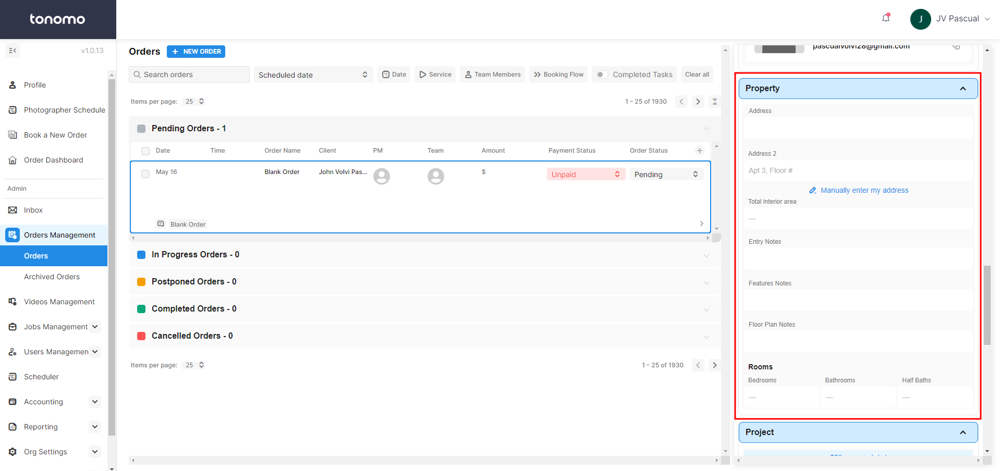<figcaption></figcaption></figure>

4\) Under **Project**, click **+ Add Service.** In the new window, select the services or package for the order that you are delivering.

<figure>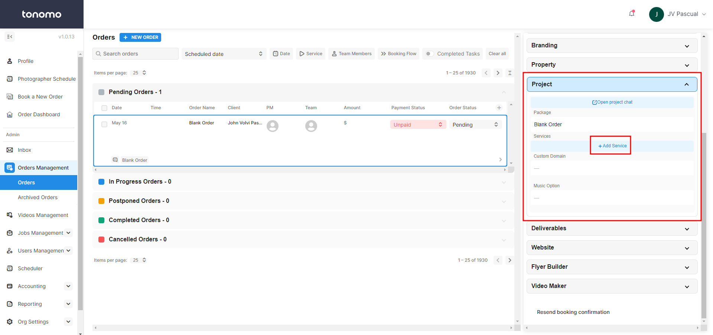<figcaption></figcaption></figure>

5\) If you've added all of these items properly, we will generate a Dropbox folder for you. Click the up Dropbox icon to the right as a shortcut to the folder. Upload your full resolution assets to their respective folders and click **Sync Delivery Files** in Tonomo.

<figure>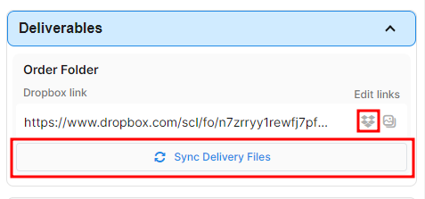<figcaption></figcaption></figure>

This will do two things. First, we'll process your full-resolution assets into MLS-sized assets and your customers will be able to download both. Second, we'll generate a formatted delivery page so your customers can see and download their assets. To get this link:

6\) Scroll to the top of the Order Details panel you've been working in and click the pencil icon. This will take you to the order summary page and the URL that you can send your customer. You can also click the arrow icon on the deliverables section for this. Re-arrange the photos and once you're satisfied, set the Order Status to **Completed** and we will send a project complete email to the customer with their delivery.

<figure>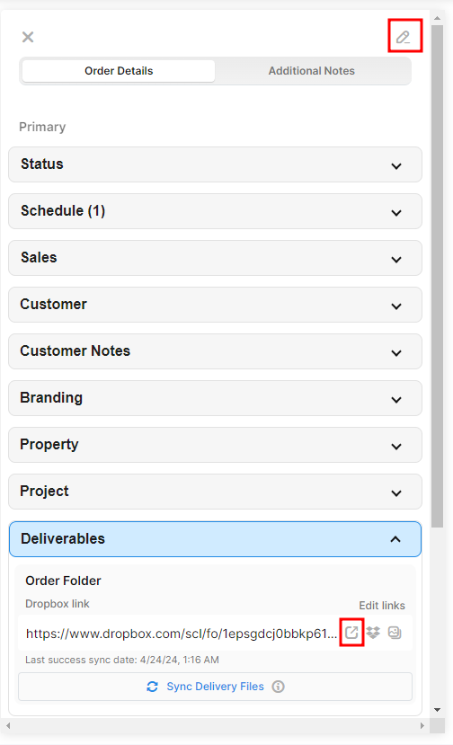<figcaption></figcaption></figure>
