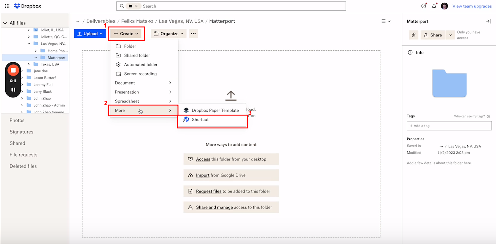
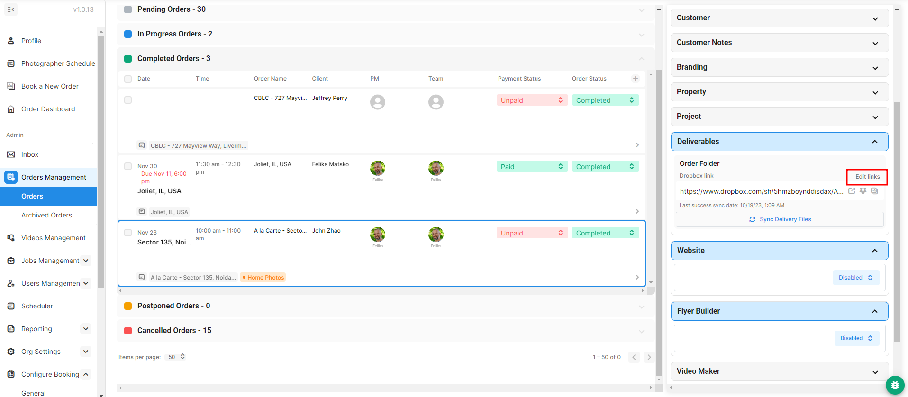

# Matterport Delivery

## Video Walkthrough



## Written Walkthrough

You have two options for delivering your Matterport project.

### Through Dropbox

Go to Dropbox and under the Matterport folder that gets created, click **Create > More > Shortcut.** You will then be able to add a link to the Matterport.

<figure><figcaption></figcaption></figure>

### Through Orders Management

Navigate to **Orders Management > Orders**, and click which order you will be adding Matterport to. Under the **Deliverables** page, click **Edit links**, and then you will be able to add a link to the Matterport.

<figure><figcaption></figcaption></figure>
