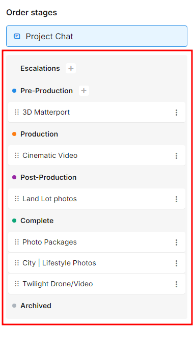

# Order Management Overview

## Video Walkthrough

If you prefer a video walkthrough, you can see one [here](https://www.loom.com/share/235e00962ffb4d779a422d1dd2350cbb). We cover the same content below, but also provide an example workflow that may be useful to you as you start to learn to use the Tonomo system.

## Written Walkthrough

So far, we've been so focused on setup and refinement. It's hard to keep in sight the whole purpose of moving over to Tonomo! Order Management is the meat and potatoes of the system. Once your Agent requests a booking, Order Management is where the order lives until they've paid the invoice.

Everything from the first consultation call to the 2nd editing revision to the final invoice will be recorded and tracked within Order Management. To get started, click on **Orders** under **Order Management**. Let's break down this part of the portal.

<figure><figcaption></figcaption></figure>

1. Increase the number of items per page if you don't see all of your orders
2. Click on a category of order to expand that list and see which orders are included.
3. Click to add which person will be the Project Manager for the order
4. Click to add those people who will be involved in producing and processing the order
5. Click to go into the project's specific management page. More info on that next!

Once you've opened the project up, you'll see quite a bit more information about this particular order.

<figure><figcaption></figcaption></figure>

On the left-hand side is each Service's status included in the order.

<figure><figcaption></figcaption></figure>

You've got different Services in different statuses like Pre-Production, Production, Post-Production, and Complete (Archive is for when an Agent cancels a Service). You can click and drag these individual Services into their statuses as the project progresses.

The center is the order's chat which is used for teammates to discuss the project internally (these messages will never be shared with the Agent).

<figure><figcaption></figcaption></figure>

The large box in the center holds the historic chat, while the box at the bottom is for entering a new message. If you're familiar with using Slack or any other instant messenger, it works much the same. You can tag teammates in your message by typing "@" and their name, for example, "@JohnSmith." This will send them a notification that they have a new message.

At the top is a small toggle that turns on and off an activity log. With this option **off**, you will only see the messages that the humans send each other. With the option **on**, we will display some notes from the portal whenever someone makes a change (in the above example, Brendan created a task, "Home Photos," and we logged that change in the order chat).

On the right side of the screen are more project details. We see **Service Details**, **Order Details**, and **Additional Notes** along the top tabs. **Order Details** are the same as we described in [Manually Creating Orders](creating-orders-for-your-customers.md), and **Additional Notes** is just a notes field if needed.

<figure><figcaption></figcaption></figure>

Under **Service Details** are the **Order Notes** and **Checklists**. These can be edited and changed by any Staff or Admins and checked off as work is completed. If you want these fields to be pre-configured, see our guide on [Notifications](https://docs.getautonomo.com/order-management/notifications) and [Checklists](https://docs.getautonomo.com/order-management/task-configuration)

## Unscheduled Orders

**Tonomo** includes a feature that automatically stores all **unscheduled orders**. This refers to any order that does **not have an assigned schedule**, regardless of its current status: **canceled, postponed, in progress, or pending**. As long as an order has no schedule, it will automatically appear in the **Unscheduled Orders** section. &#x20;

<figure><figcaption></figcaption></figure>
