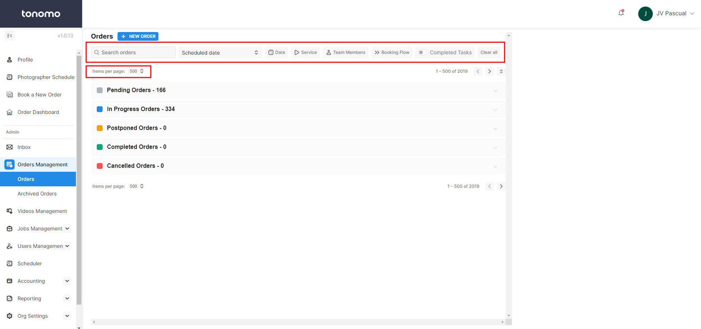
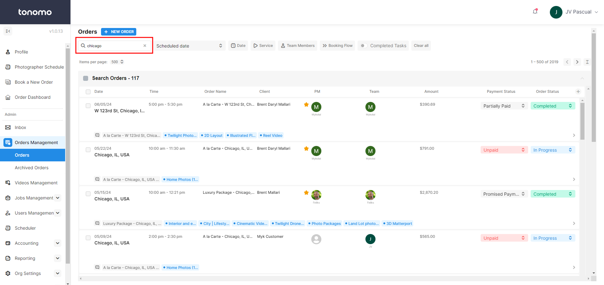
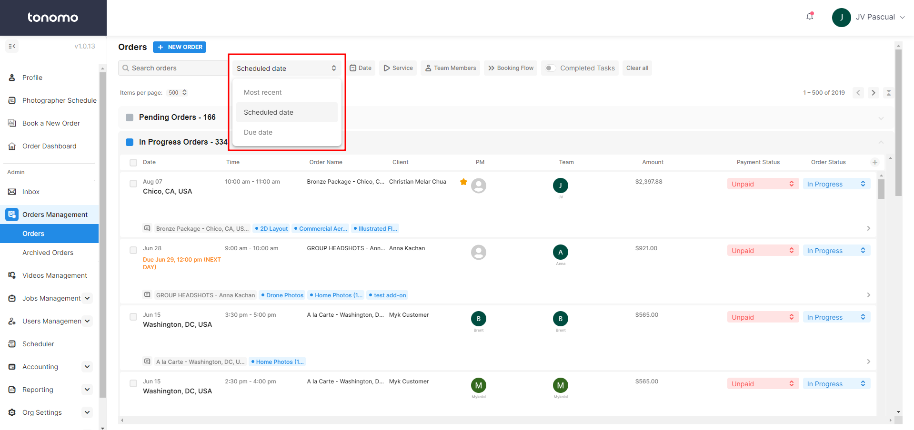
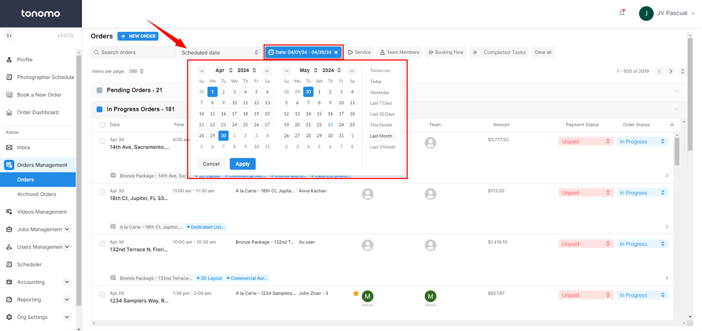
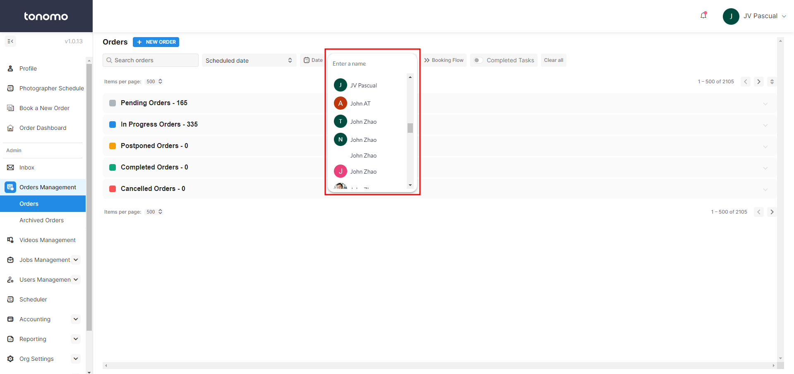
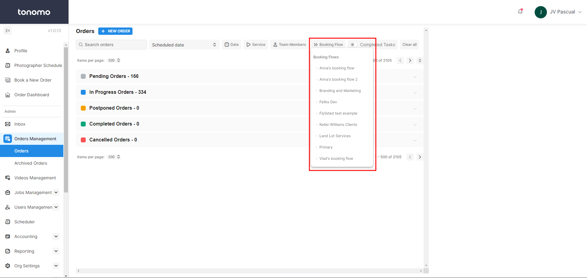
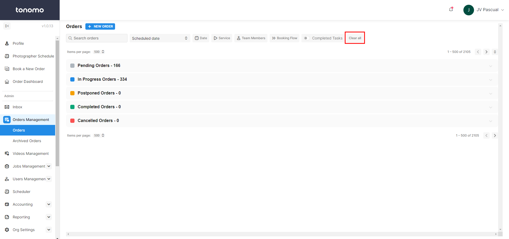
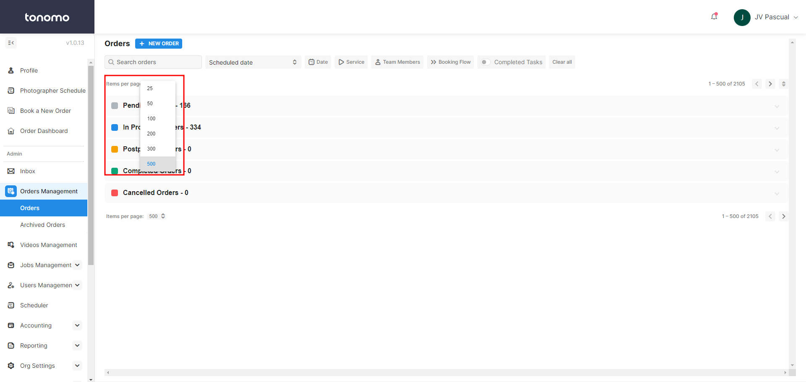

# Orders Management Filter

In Tonomo, you can filter the order depending on what you are looking for. This enhances the user experience and streamlines the process of order selection. These filters allow an admin to easily sort and select orders based on their specific needs, making the process of finding the right orders more efficient and personalized.

<figure><figcaption></figcaption></figure>

## Search Orders

We offer a search feature where you can find specific orders using details such as the client's name, address, services, and more.

<figure><figcaption></figcaption></figure>

## Scheduled Date

This feature allows you to apply filters, and the system will automatically sort the orders for you:

* **Most Recent**: Sorts orders by the date they were booked.&#x20;
* **Scheduled Date**: Sorts orders by the shoot date.&#x20;
* **Due Date**: Sort orders by their due date.

<figure><figcaption></figcaption></figure>

## Date

This filter works alongside the Scheduled Date filter. When a specific date is selected, it will:

* **Specific Date + Most Recent**: Display orders booked on that date.
* **Specific Date + Scheduled Date**: Display orders scheduled to be shot on that date.

<figure><figcaption></figcaption></figure>

## Services

Filter for a specific service in this section to view only the orders with those services.

<figure><figcaption></figcaption></figure>

## Team Members

Filter for a specific team member to see the events they are assigned to.

<figure><figcaption></figcaption></figure>

## Booking Flow

Filtering by specific booking flow allows you to view orders associated with that particular booking flow. This is especially useful if you have a booking flow designed for a specific brokerage and want to see how many orders they have.

<figure><figcaption></figcaption></figure>

## Completed Task

This filter is useful for managing your orders. Toggling it on will automatically filter out completed tasks or services. This will only function if you are actively moving services through the [order stages](order-management-overview.md#written-walkthrough).

<figure><figcaption></figcaption></figure>

## Clear All

Instead of removing filters one by one, using this option will clear all existing filters you have at once.

<figure><figcaption></figcaption></figure>

## Items Per Page

In this section, selecting a number will adjust the total number of orders visible on the page. You can choose to display as few as 25 orders or as many as 500 orders per page.

<figure><figcaption></figcaption></figure>
