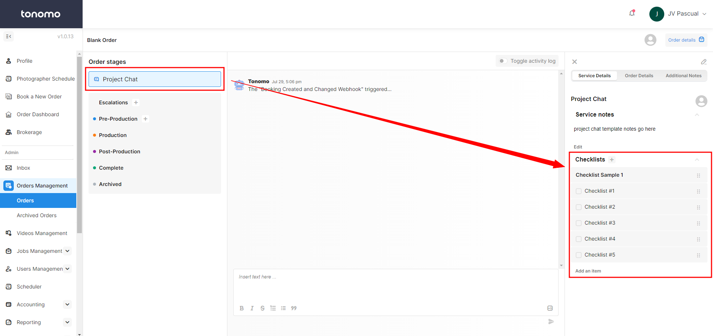
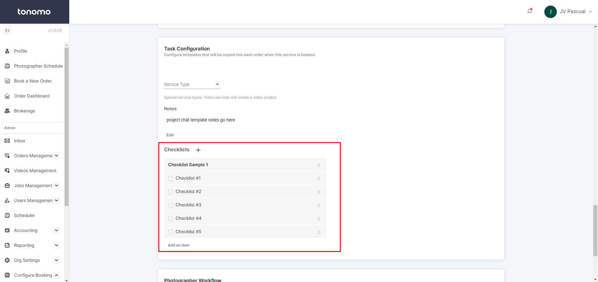

# Project Chat Checklists

Aside from having a checklist for each service, you can also add a checklist to the project chat. This creates a preset checklist that helps with project management. One advantage of this is that you won't need to click on the specific service for the checklist to appear. Once you open the project chat, the checklist will be available right away.

<figure><figcaption></figcaption></figure>

Steps to create checklist for the project chat:

1. Create a service named "Project Chat"
2. Under the **Task Configuration** of the service, add the checklist that you need.

<figure><figcaption></figcaption></figure>


* The checklist will appear on orders booked after creating the service and will not show on past orders.
* The service "Project Chat" does not need to be added to the booking flow.


