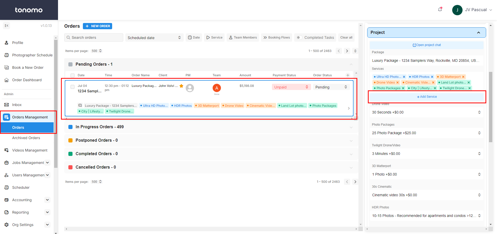
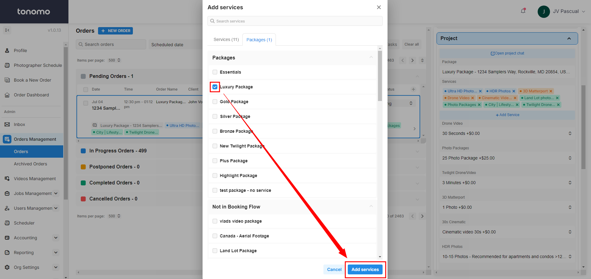
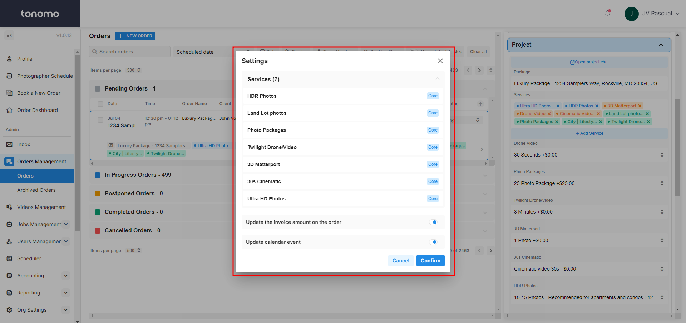

# Removing Services After Booking

This article will guide you through removing a Service from an order after the customer has already booked. This option is only available for accounts with admin or staff access.

Steps to Remove a Service:

1. **Navigate to Orders Management:** Go to _Orders Management > Orders_ and select the relevant order.
2. **Access the Project Tab:** On the right-hand side, in the Order Details Panel, open the _Project_ tab.

<figure><figcaption></figcaption></figure>

3. **Remove the Desired Service:** Uncheck the service you want to remove. If you need to remove an entire package, go to the package section and uncheck the package. This will automatically remove all services attached to that package.

<figure><figcaption></figcaption></figure>

4. **Confirm Changes:** A popup window will appear, showing the remaining services. You'll have the option to update the invoice and calendar event. Confirm the changes after making your selections.
   * **Update Options:**&#x20;
   * 4.1 **Update Invoice Amount:** Toggle on the "Update the invoice amount on the order" option to remove the item from the invoice and subtract the associated price from the total.&#x20;
   * 4.2 **Update Calendar Event:** Toggle on the "Update calendar event" option to automatically adjust the schedule and update the remaining services on the email and calendar event.

<figure><figcaption></figcaption></figure>
