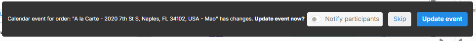

# Updating the Address After Booking

To update the property address at the client's order or if an incorrect address was entered during booking, please follow the steps below:

1. Select the specific order that requires updating.
2. Navigate to the order "Property" tab within the order dashboard.
3. Here, you will find the current address, total interior area, notes, as well as the number of rooms and bathrooms.

<figure><figcaption></figcaption></figure>

4. Input the new address in the designated field. Google Maps will provide a recommended address. If the address is not displayed by Google, you may enter it manually.\

<figure><figcaption></figcaption></figure>

5. Once you have entered the address, a prompt message will appear below confirming your changes.

<figure><figcaption></figcaption></figure>


Once you update the address, an option to update the invoice will prompt. Please note that changing the address may result in an adjustment of the travel fee, which could either increase or decrease based on the new location. Additionally, when you change the property address while the website is enabled you will need to manually change the address in the website admin panel.

