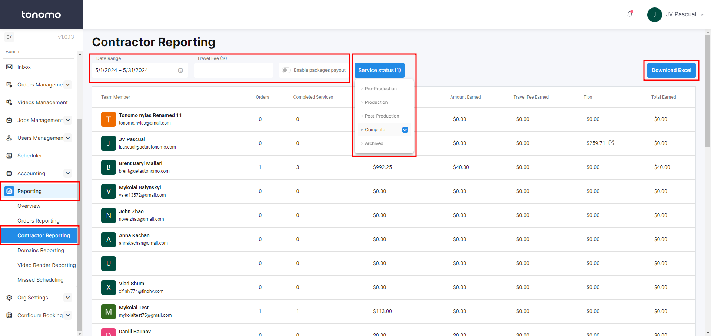
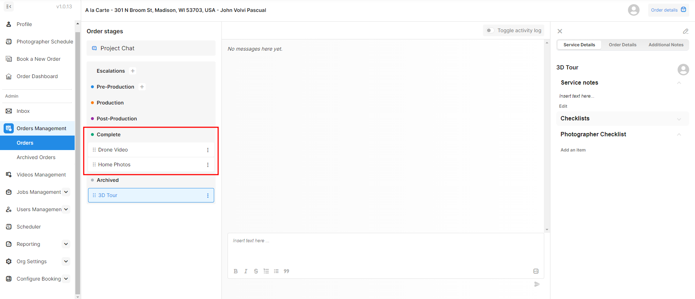

# Contractor Reporting

Contractor Payout Reporting allows you to easily calculate what you owe your contractors and staff for their work. To access it, see **Contractor Reporting** under **Reporting**.

<figure><figcaption></figcaption></figure>

First, set a **Date Range**.

Then, enter what percentage (%) of the travel fee you share with your contractors, and by default, it's 100%. But you could enter 90%, for example, to share with them 90% of the travel fee while you retain 10%.

Displayed in the table are all staff members with a **calendar connected**. This means that editors or project managers who are assigned to an order but don't have a calendar connected won't appear.

Next, **Service Status** is what Service status you want to appear in the report. You may not be using our feature to manage the statuses of individual services per order. So if you are not, then you will want to check all statuses except Archive so that we can give credit to photographers for all orders.

<figure><figcaption></figcaption></figure>


In it's current form, Contractor Payout Reporting double counts orders with more than one photographer. Meaning, if two photographers are on an order with a Completed Service, we will assign the full $ value of that order to **both** photographers.


You can also download this report to Excel in the top-right corner.
