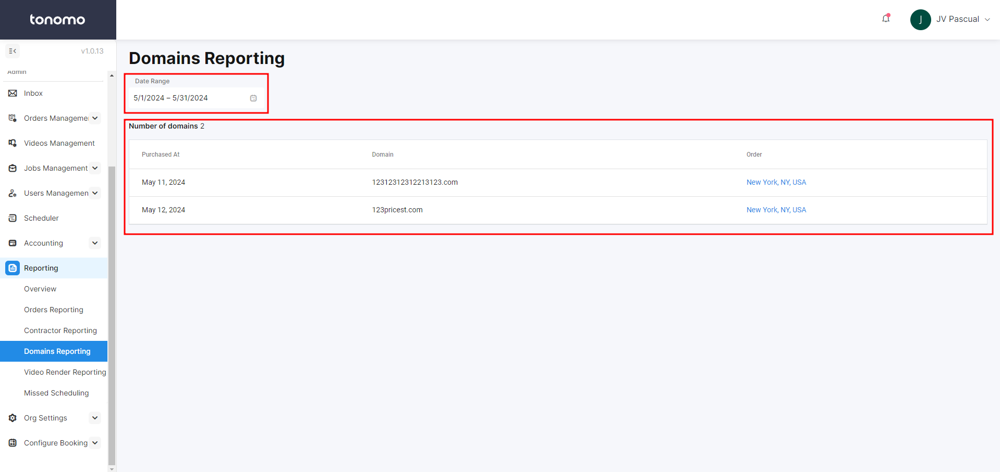

# Domains Reporting

Domains Reporting allows you to easily track how many custom domains you are getting each month. To access it, go to **Domains Reporting** under the **Reporting** section.

<figure><figcaption></figcaption></figure>

First, set a **Date Range**. Then, the numbers of domains will appear along with the following details:

* Date Purchased
* Domain
* Order Name with Order Link
