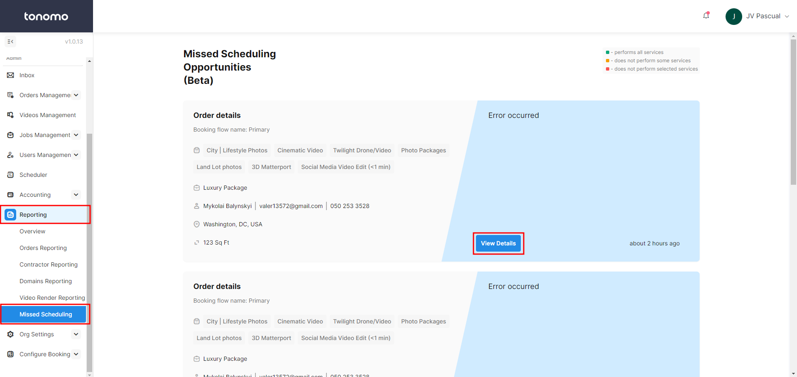
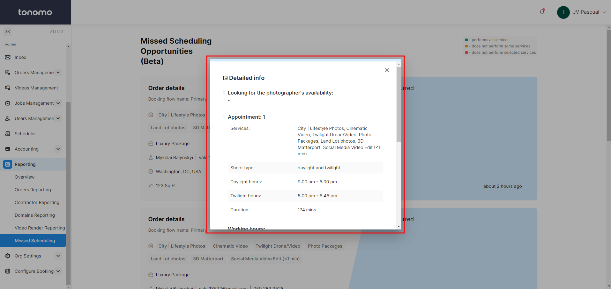

# Missed Scheduling

This page is dedicated to all the missed scheduling of clients. It helps the admin analyze issues or understand what went wrong that prevented clients from completing the scheduling process.&#x20;

This includes all order details such as address, square footage, services or packages included, and more.

<figure><figcaption></figcaption></figure>

By clicking "View Details," a popup window will appear with detailed information on the order and the reason why it did not go through.

<figure><figcaption></figcaption></figure>
