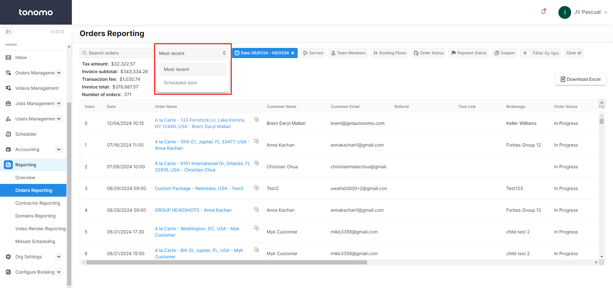
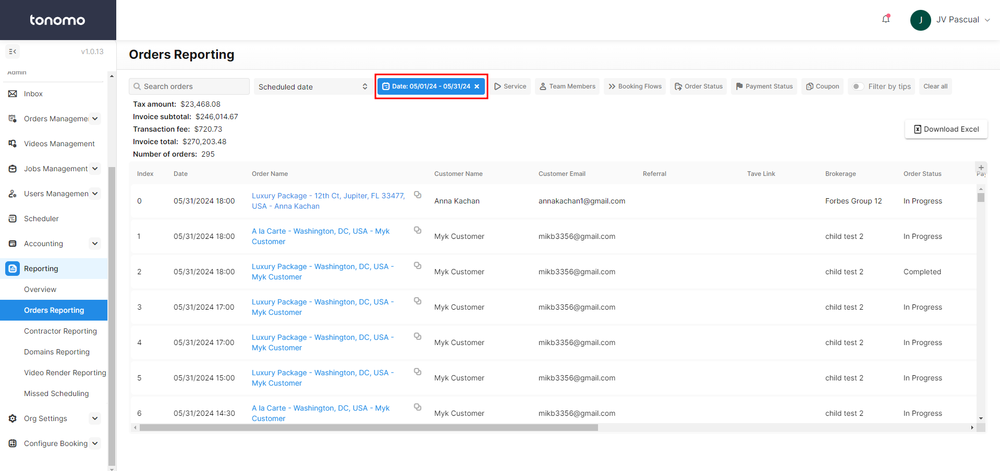
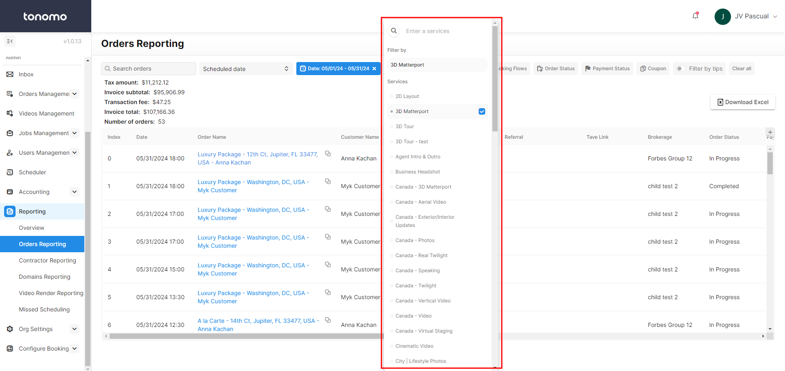
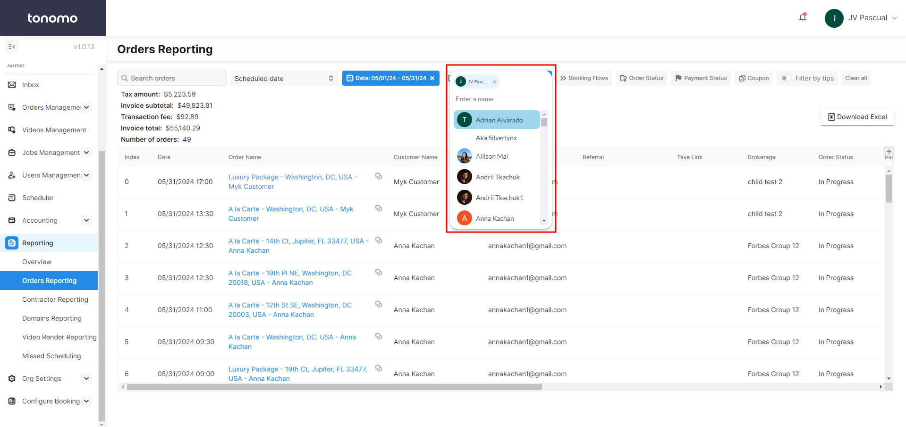
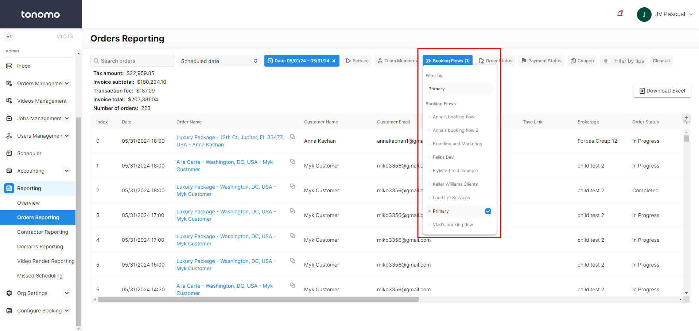
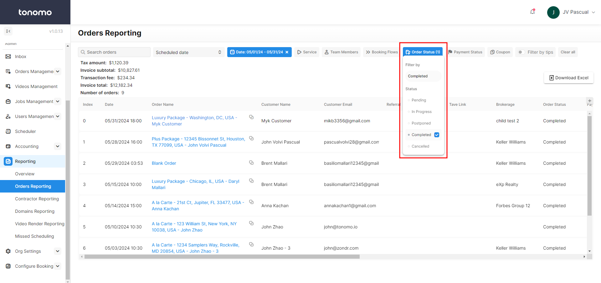
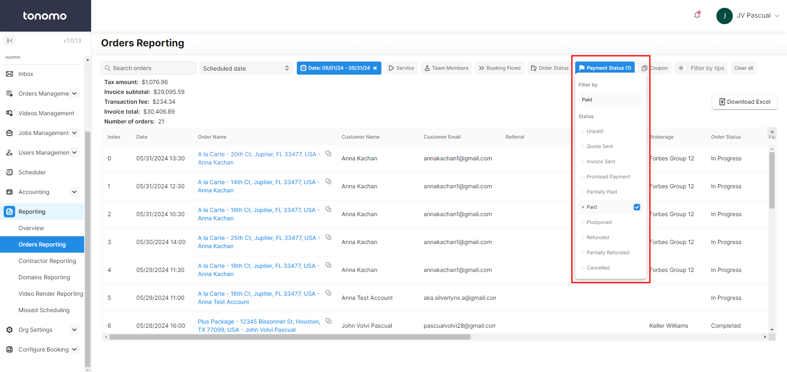
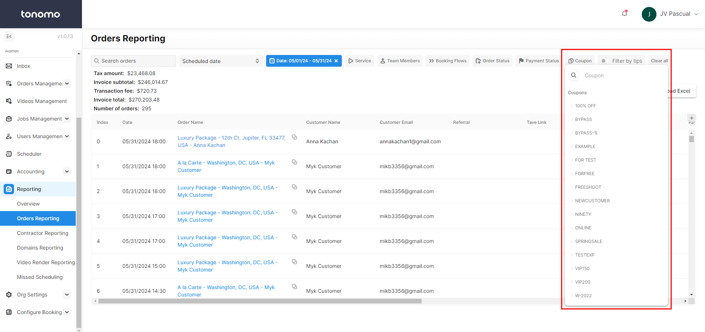
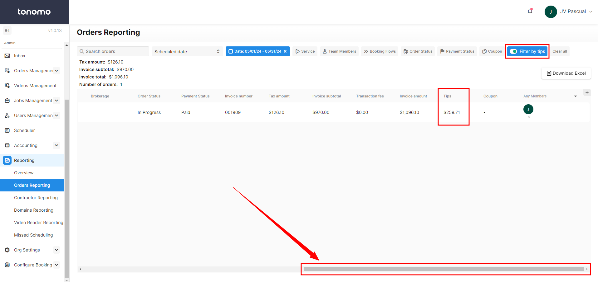
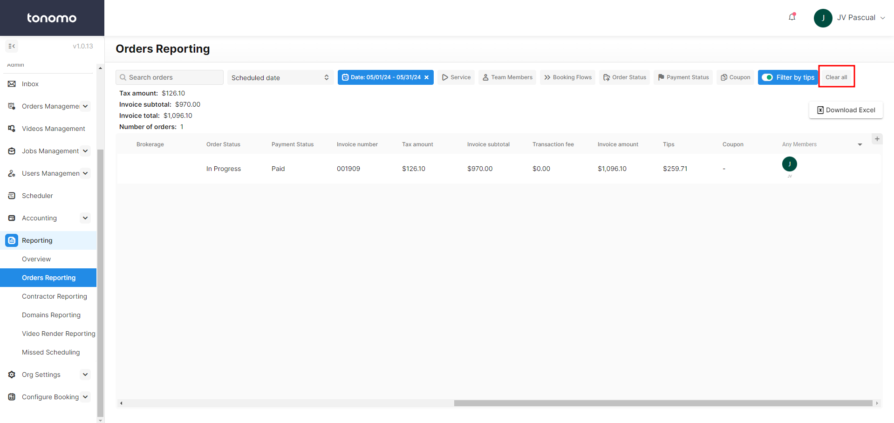

# Orders Reporting

## Overview

Orders Reporting provides all the order details you need on your portal. It also includes filters that enhance the user experience and streamline the order selection process. These filters allow admins to easily sort and select orders based on their specific needs, making it more efficient and personalized to find the right orders. **First, you need to select a date range for this to work.**

<figure><figcaption></figcaption></figure>


The advantage of using **Orders Reporting** over **Orders Management** is that it allows you to filter by payment status, coupon used, and tips.


## Search Orders

After selecting a date range, you can use the search feature to find specific orders using details such as the client's name, address, services, and more.

<figure><figcaption></figcaption></figure>

## Scheduled Date

This feature allows you to apply filters, and the system will automatically sort the orders for you:

* **Most Recent**: Sorts orders by the date they were booked.
* **Scheduled Date**: Sorts orders by the shoot date.

<figure><figcaption></figcaption></figure>

## Date

This filter works alongside the Scheduled Date filter. When a specific date is selected, it will:

* **Specific Date + Most Recent**: Display orders booked on that date.
* **Specific Date + Scheduled Date**: Display orders scheduled to be shot on that date.

The date filter works in conjunction with other filters, helping the admin to view the exact order they are looking for.

<figure><figcaption></figcaption></figure>


This needs to be selected for the data to appear.


## Service

Use the service filter in this section to view only the orders with those services within the selected date range.

<figure><figcaption></figcaption></figure>

## Team Members

Use the team member filter to see the events they are assigned to within the selected date range.

<figure><figcaption></figcaption></figure>

## Booking Flow

Filtering by a specific booking flow allows you to view orders associated with that particular booking flow. This is especially useful if you have a booking flow designed for a specific brokerage and want to see how many orders they have within the selected date range.

<figure><figcaption></figcaption></figure>

## Order Status

Filtering by order status allows you to view orders with a specific status within a selected date range.

<figure><figcaption></figcaption></figure>

## Payment Status

Filtering by payment status allows you to view orders with a specific payment status within a selected date range.

This helps you identify which orders have been paid and which haven't.

<figure><figcaption></figcaption></figure>

## Coupon

Using the coupon filter will only display orders that have used the specific coupon you selected.

<figure><figcaption></figcaption></figure>

## Filter by Tips

Filtering orders by tips will only show orders within the selected date range that include a tip.

<figure><figcaption></figcaption></figure>

## Clear All

The "Clear All" option can be used to remove all filters at once.

<figure><figcaption></figcaption></figure>
