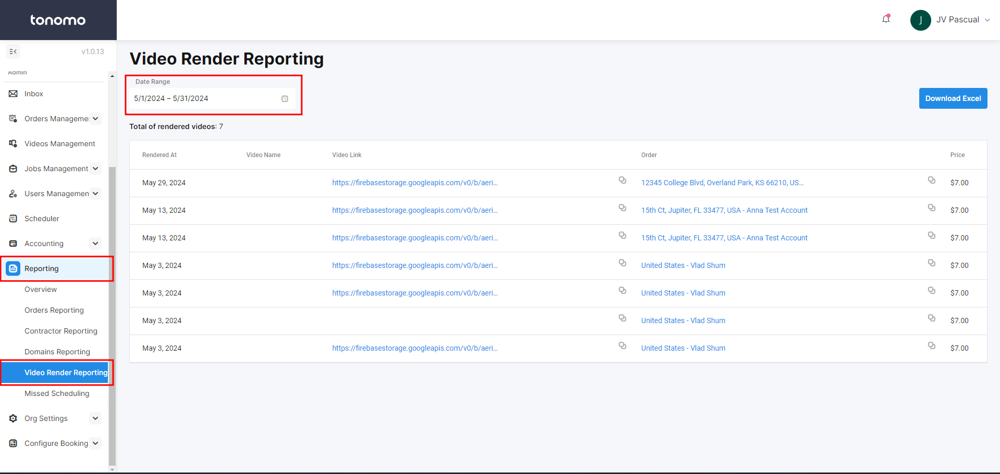

# Video Render Reporting

Video Render Reporting allows you to easily track how many video renders you are doing each month. To access it, see **Video Render Reporting** under **Reporting**.

<figure><figcaption></figcaption></figure>

First, set a **Date Range**. Then, the numbers of domains will appear along with the following details:

* Rendered Date
* Video Name
* Video Link
* Order with Order Link
* Price


It says that the cost per video is $7, but right now Tonomo is offering this for **FREE**!

