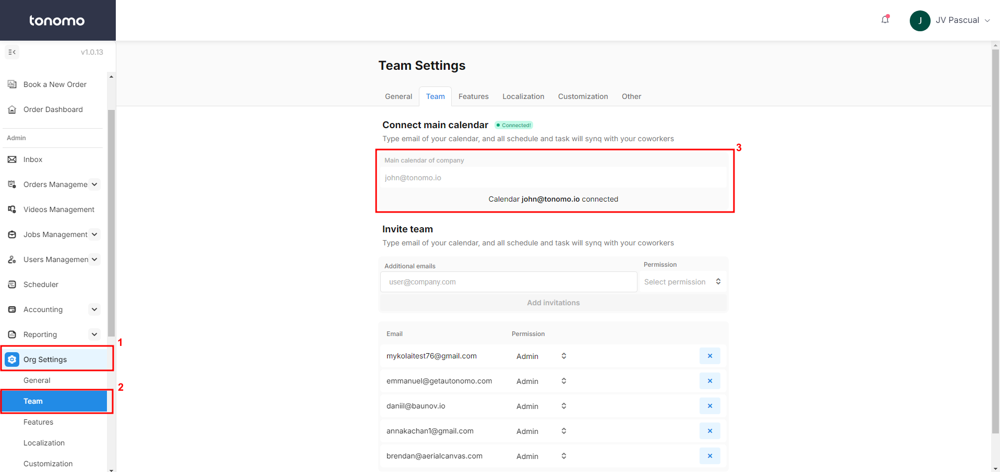
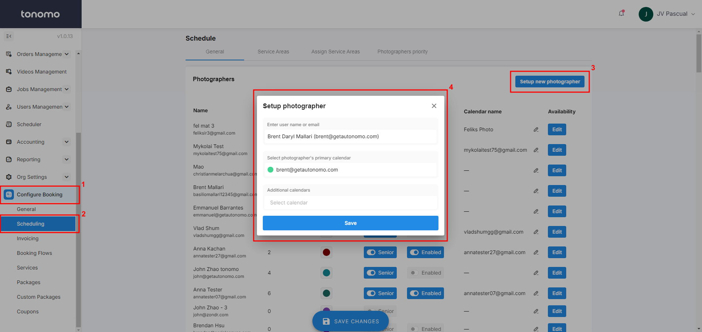
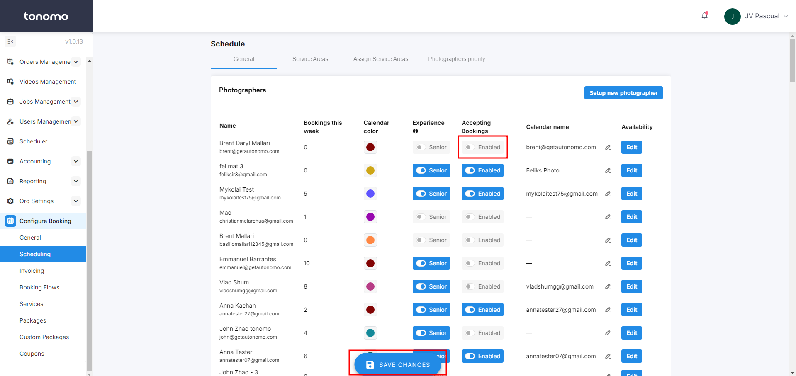

# New Calendar Integration

## Connecting a Primary Account

Tonomo has a built-in calendar integration suite that allows you to manage bookings, event details, and view photographer availability all in one place. Setting up calendar integration also unlocks additional features like Integrated Booking, enabling agents to book services directly from the booking flow. We'll configure this later if needed, but for now, let's focus on getting Tonomo connected with your primary calendar.


Currently, our calendar integration is only available with Google Calendar. If you have any concerns about other calendar providers or need assistance, please reach out to Tonomo Customer Support through your private Slack channel to your Tonomo Onboarder!


When you integrate a main calendar with Tonomo, that calendar will "own" all the events Tonomo creates. This account will have the ability to edit or delete calendar events within your calendar provider. We recommend using a generic account, like info@yourcompany.com or booking@yourcompany.com, instead of one tied to a specific person. This avoids potential issues if the account holder loses access or if someone else needs to make changes to events in an emergency.

Whichever account you're going to use, you may **Connect primary calendar account** under the **Org Settings > Team**.

<figure><figcaption></figcaption></figure>

If you have a generic email account like info@yourcompany.com, use that. If you do not, use a senior person's account, choose someone that will be with the company for a while.

### Less Secure Apps

When connecting an account for the first time, you may receive a warning that you are attempting to connect a "Less Secure App" from Google. If this occurs, follow the steps in your [admin console.](https://myaccount.google.com/lesssecureapps)

## Connecting User Accounts



With our upgraded integration, you'll be able to onboard and set up your photographers quickly on Tonomo. To view availability and manage events for your staff, an Admin will need to set up a new photographer profile for each member.

**Step 1:** The photographer will need to share their Google calendar(s) with the primary calendar connected to Tonomo, granting "Make changes to events" permission. This allows Tonomo to view external event details and measure travel time from the booking address to any external event location if included.

For detailed instructions on sharing calendars and understanding the different permission levels, please refer to this [Google Calendar documentation](https://support.google.com/calendar/answer/37082?hl=en\&authuser=2#zippy=%2Cunderstand-permission-settings-for-shared-calendars).

<figure><figcaption></figcaption></figure>

**Step 2:** After accepting the calendar invite, you can set up the photographer under **Configure Booking > Scheduling**.

* **Enter User Name or Email**: Only users with Admin, Staff, and Contractor access will appear in this section as a dropdown. You just need to select the photographer from this list.
* **Select Photographer's Primary Calendar**: A dropdown of photographers' calendars will appear. You need to select the correct Google Calendar for the photographer. If their email is not listed, it means they haven’t shared their Google Calendar with the primary calendar. Please refer to Step 1 for details on sharing.
* **Additional Calendars**: Tonomo can also reference multiple calendars to determine the availability of a single Photographer. In this section, you can add as many additional calendars as needed for each photographer

<figure><figcaption></figcaption></figure>

**Step 3:** After setting up a new photographer, simply toggle on **Enabled** and click **Save Changes**.

<figure><figcaption></figcaption></figure>
