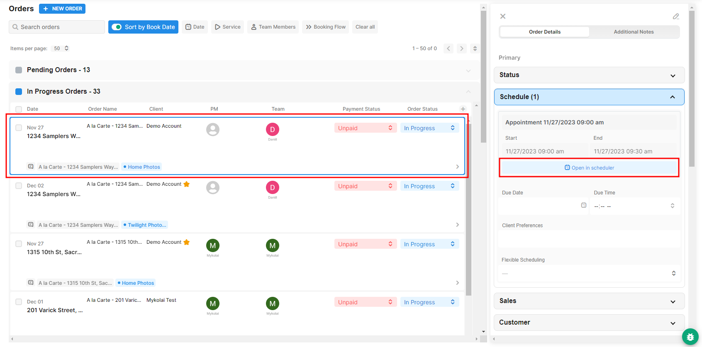

# Add New Appointment to Existing Appointment

1. Click on your Order in **Order Management** to open the Order Details panel on the right. Click **Open in Scheduler**.

<figure><figcaption></figcaption></figure>

2. Click on "**Add new appointment**" at the bottom left under the **Order Details**. Select the time slot for the new appointment.

<figure><figcaption></figcaption></figure>
