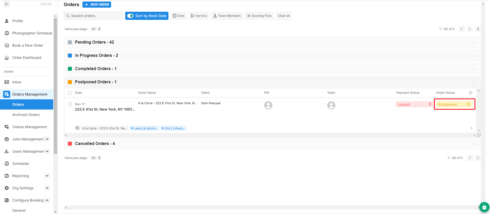

# Create Calendar Event After Postponing or Cancelling

If you've postponed an event and deleted the Calendar event.

<figure><figcaption></figcaption></figure>

After you move the order back into In Progress, you need to manually recreate the Calendar event.

<figure><figcaption></figcaption></figure>

To do so, locate the calendar of the photographer you want to assign the order to. Click and drag on the schedule to create the Calendar event for the time and date preferred.

<figure><figcaption></figcaption></figure>

After clicking the desired date and time under the photographer's calendar, this window will pop up. You still have the option to change the details. When done, click **Save Event** at the bottom to save.

<figure><figcaption></figcaption></figure>
