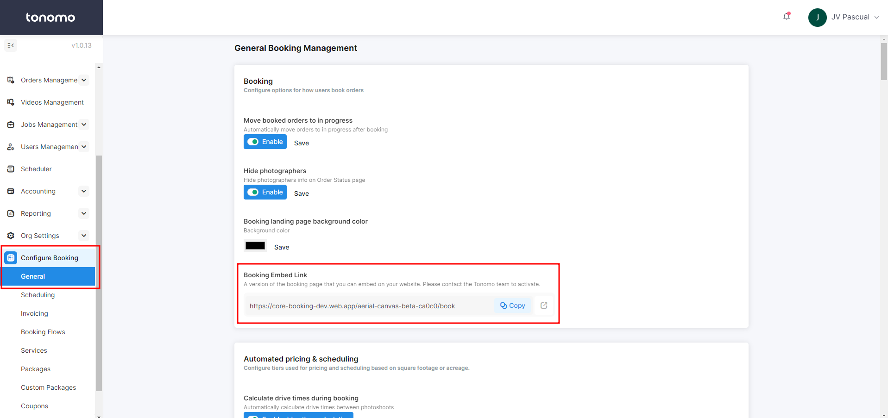
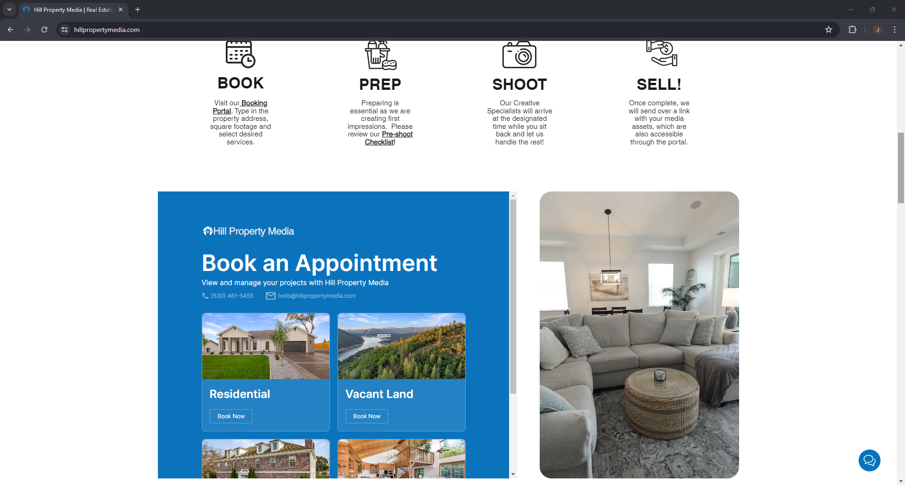

# Embed Booking Flow

Linking the portal to your website's "Book Now" button is a common practice, but you can also embed the portal directly into your website. To do this, navigate to **Configure Booking > General**, where you'll find the Booking Embed Link. You can use this link to seamlessly integrate the booking flow into your website.

<figure><figcaption></figcaption></figure>

Here's an example from one of our clients, Hill Property Media, showcasing the embedded booking flow on their [website](https://www.hillpropertymedia.com/).

<figure><figcaption></figcaption></figure>


Once you decide to embed the booking flow, please let the Tonomo team know about this to enable some settings.

