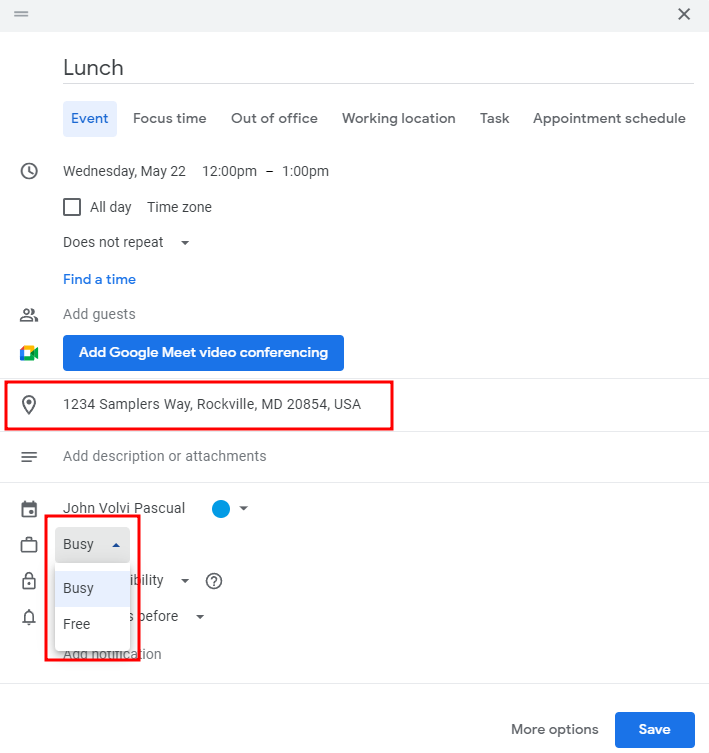
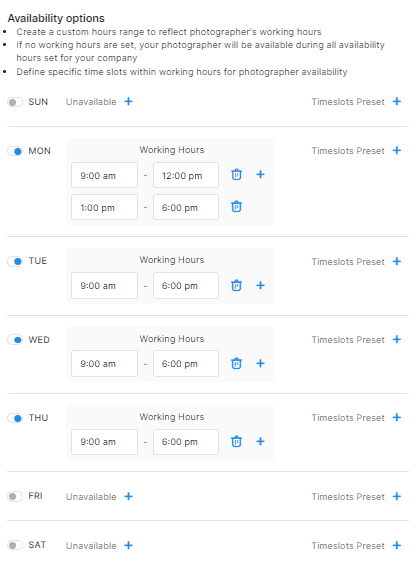
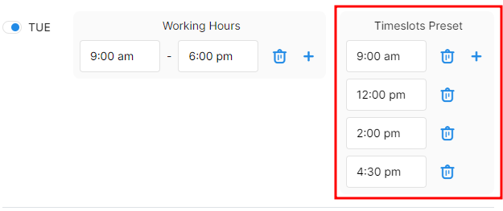
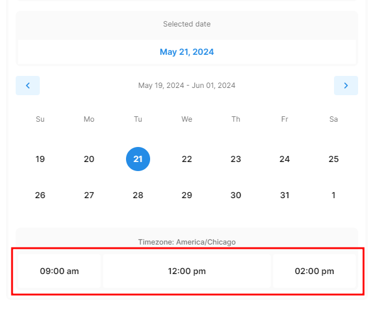

# Photographer Availability



### Calendar Availability

With [Integrated Booking](https://docs.getautonomo.com/scheduling/integrated-booking), one of the criteria the system will use to see if we can assign a booking to a photographer is if their calendar has any availability for the requested Services. If the photographer has an hour lunch at 12pm every day blocked out on their calendar and it's set to busy, we will respect that and not book anything during that time.

Within Tonomo, as you add photographers, it might end up looking like something like this.

In grey are events on the photographer's calendar that are unrelated to shoots like that "Tuesday - Q\&A" meeting. In this case, if someone books during that time, this photographer won't be assigned the shoot.

If you're wondering why a photographer is coming up as available when they shouldn't (or vice versa), most calendars can mark an event as "available" or "busy". Only events that are "busy" will block availability in Tonomo. This is what it looks like in Google Calendar.

There is also an option to add an address to the event, and it will automatically be used when Tonomo calculates the travel time for the next event.

<figure><figcaption></figcaption></figure>


_If you use your calendar for reminders that you don't want to block availability in Tonomo, make sure those are being set to "Free"_


### Tonomo Availability

In addition to calendar availability, you can set regular schedules for each photographer within Tonomo under **Configure Booking** > **Scheduling** on the left-hand side.

Then, click **Edit** for the photographer you want to give a schedule.

.png>)

All photographers will default to an empty schedule. Rest assured, if all days of the week are "unavailable", then effectively the feature is turned off and they have maximum availability.

.png>)

You may set a photographer to something like this where they are not available every Monday for an hour at noon, but available all day for the rest of the week until Friday when they are unavailable.

<figure><figcaption></figcaption></figure>

The intention for this feature is when photographers have standard, repeatable availability schedules. So if a photographer has a doctors appointment, add it to their calendar and we'll block it out. If a photographer never works for you on Fridays, then block it out in Tonomo.

**Timeslots Preset** allows you to choose specific timeslots for a certain photographer instead of increments. This acts as a time block for the photographer.

<figure><figcaption>
Timeslot Preset Settings
</figcaption></figure>

<figure><figcaption>
Schedules Using Timeslot Preset
</figcaption></figure>
