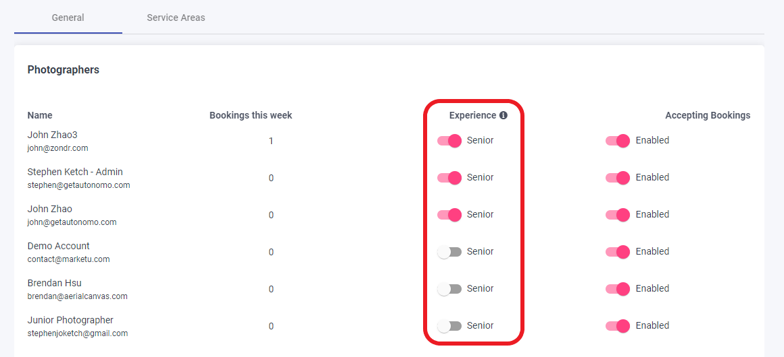

# Send two Photographers

On projects of considerable length, you may want to send two photographers so that your staff spend less time on-site. This is configurable by the hour, so you can send one photographer for shoots less that only last three hours, but send two photographers for shoots four hours or longer. Go to **Configure Booking** > **Scheduling** > and enter a value within **Send 2 Photographers**.

Make sure to click **Save Changes**.


The length of the shoot is determined by the Scheduling you set in each Service or Package. So if an Agent requests three Services that are 1 hour each, that would be a 3 hour shoot.\
\
The length of shoot does not include either of the 30 minute buffer periods we automatically build in before and after the shoot.


If a shoot is the length or longer than the value you enter here, it will look for two photographers who have the skills, availability, and service the area to schedule. But it will **always** assign the order to a pair of photographers that include a **Senior** photographer. To change who is a Senior photographer, select from the toggles at the top of the page.

This means that even if two junior photographers are available, it will not allow Agents to book during that time. It will only show time slots where a Senior photographer + one other (Junior or Senior) have the Skillset, Availability, and Service Zone that match the booking they are requesting.
