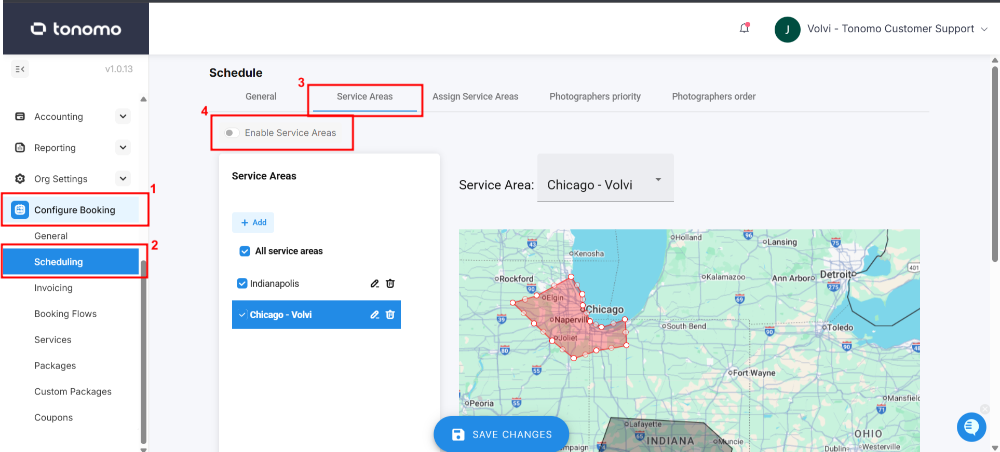
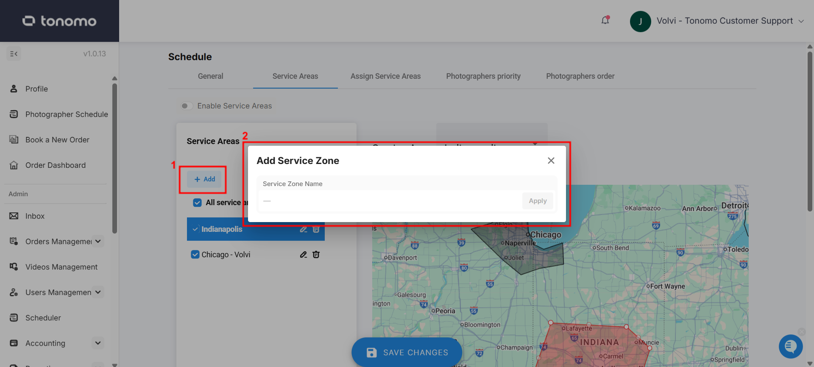
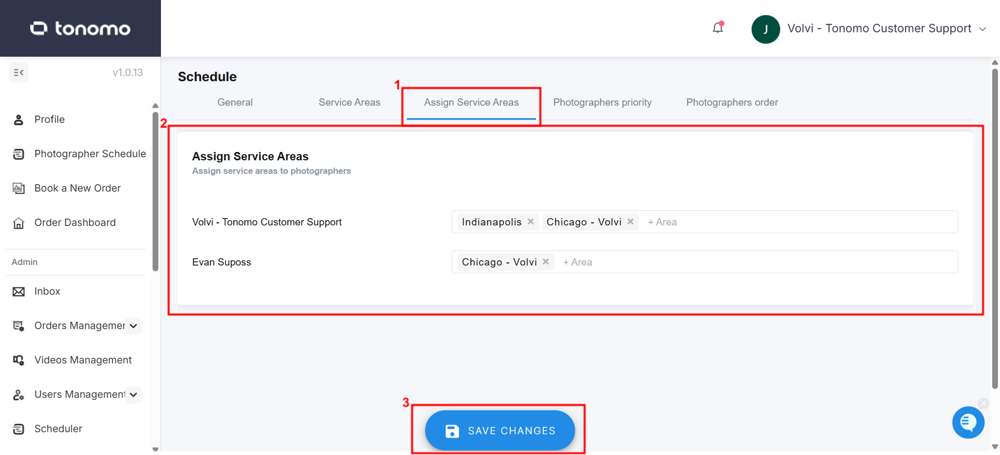
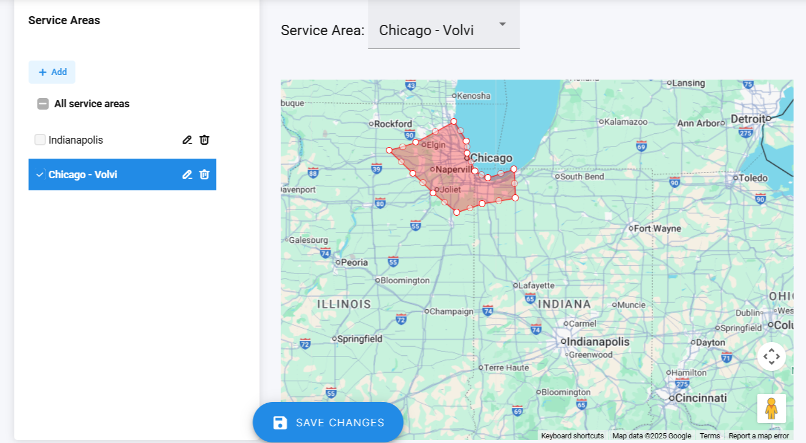

# Service Area

## Video Walkthrough



## **Service Area**

**Service Areas** are geographical regions that help manage where your photographers are assigned. For example, if you have a photographer based on the south side of town, you can assign them to a **South Service Area** so they don’t need to drive over an hour to reach a shoot. If a photographer covers more than one region, you can assign **multiple Service Areas** to them. This helps reduce travel time, lower costs, and improve overall efficiency—especially if you have enough photographers in each area to meet booking demand.

First, to get to Service Areas, click **Configure Booking** > **Scheduling** > **Service Areas** > click **Enable Service Areas**.

<figure><figcaption></figcaption></figure>


If Service Areas are **turned off**, photographers will be able to accept bookings from **all geographical areas** by default.


After that, click the **“+ Add”** button to create a new Service Area. Give your area a name, then start plotting it on the map. Click anywhere on the map to place your first point, then continue clicking to add more points and outline the area. Be sure to close the shape by clicking back on your starting point.

<figure><figcaption></figcaption></figure>


* You can name a Service Area after the photographer assigned to it for easier identification.
* If you don’t see the area you want, try zooming out, especially if it’s your first time setting up an area.


Once your Service Areas are created, you can start assigning them to your photographers.\
Go to the **“Assign Service Area”** section and select the appropriate areas for each photographer. You can assign a **single Service Area** or **multiple Service Areas**, depending on where each photographer is available to work. Don’t forget to click **“Save Changes”** to apply and save your updates.

<figure><figcaption></figcaption></figure>

To see a photographer's Service Area, check or uncheck the boxes on the left and the Service Area highlighted in red on the map is the one that you are editing. The others will be in black.

<figure><figcaption></figcaption></figure>

## Custom Message for Out-of-Area Bookings

A custom message for out-of-area bookings appears when an agent tries to book a shoot outside your defined Service Areas. To edit this message, go to **Configure Booking > Scheduling > Service Areas** and update the **“Custom Message for Out-of-Area Bookings”** field. You can include any message you like, including contact details or instructions for handling requests outside your coverage. If no custom message is set, a default template will be used.

<figure><figcaption></figcaption></figure>
