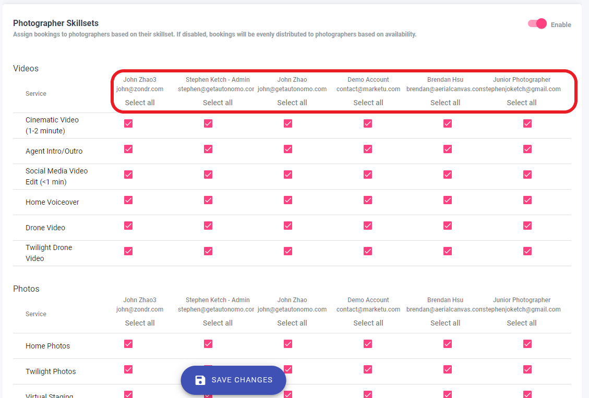
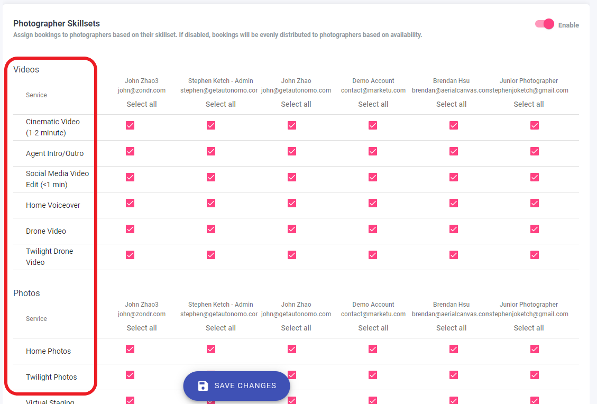

# Staff Skillsets

Not everyone of your staff members may yet be trained on all of the Services you offer and so you can set Tonomo to prevent booking those photographers on projects they lack skills in.

To turn this on, click **Configure Booking** > **Scheduling** > **Enable**.&#x20;

Across the top of the table in the columns are  your photographers

Across the rows are the Services in the Tonomo portal organized under their categories.

A checked box means that Tonomo _will_ book that photographer for that Service (assuming all of the other criteria like availability match). An unchecked box means that Tonomo _will not_ book that photographer for that Service, _regardless_ of whether they are available or not.\
\
Be sure to click **Save Changes**!

