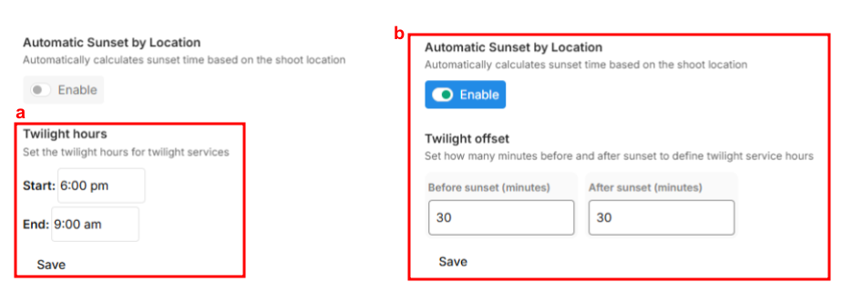

# Twilight Shoots



Some Services need to be completed at a different time of day than the bulk of services ordered. For example, a Twilight Shoot needs to be completed at 6pm while everything else was shot at 11am.

You can configure the system to require your customers to book two appointments at the time of booking so that you and your customer get the correct scheduling information for every order.

## Set Service to Twilight Service

1. First, you’ll need to configure which hours you consider as **Twilight Hours**. This can be adjusted manually at any time to reflect seasonal changes, or set to adjust automatically. To set this up, go to **Configure Booking > General**, and under the **Scheduling** section, you’ll find two options for defining your Twilight Hours.
   1. **Manual Twilight Hours** allow you to set a fixed start and end time for twilight shoots. This is a preset schedule and does not automatically adjust based on the day's actual sunset time, which may affect the accuracy of twilight duration.
   2. **Automatic Sunset by Location** calculates the sunset time based on the shoot’s location. Once enabled, you’ll need to set a **twilight offset**, which should be equal to or greater than your longest twilight duration. This offset determines the timing of twilight shoots and ensures the schedule automatically adjusts based on local sunset times.


The first set of availability hours should be when you normally take **daytime** appointments. However, if you toggle on **don't split appointments** we allow customers to book daytime events **after** these hours in the cases where they're also booking a Twilight appointment.\
\
For example, if your daytime hours usually end at 6:00pm and Twilight begins at 7:00pm, we'll allow customers to book the daytime portion of their shoot at 6:30pm so that it can lead directly into 7:00pm for the twilight shoot.


<figure><figcaption></figcaption></figure>

2. Next, you must configure which Services are **Twilight Services.** Under **Configure Booking** > **Services** click the triple dots and **Edit** button for the Service that should be Twilight.

<figure><figcaption></figcaption></figure>

3. Under the **General** box, toggle on **Twilight Service** and click **Save**.

<figure><figcaption></figcaption></figure>

4. To test your changes, click **Book a New Order**, then refresh the page to apply the updated settings.
5. Book an order like normal, ensuring you select the Service you set to **Twilight Service** and one other Service that **is not** Twilight Service.
6.  On the Scheduling Page you should be prompted to enter two appointments, one for the Service(s) you selected that are not **Twilight Services**, and one for the Service(s) you selected that are **Twilight Services**.

    <figure><figcaption></figcaption></figure>
7.  After you submit the order, go to view the order in **Orders Management** and you should be able to see two appointments under **Schedule** on the right hand side.

    <figure><figcaption></figcaption></figure>
