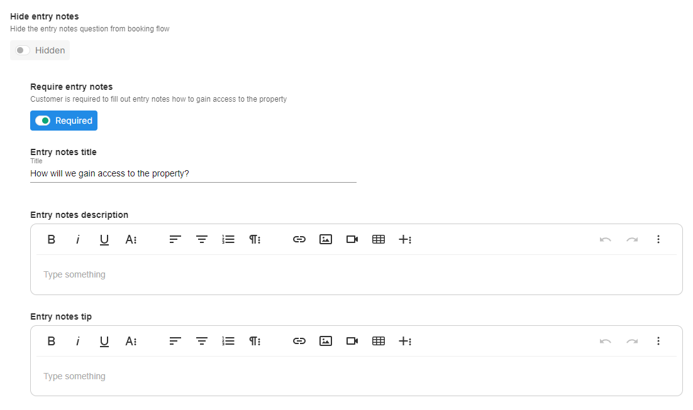

# Booking Flows

Once your **Services** and **Packages** are added to the Tonomo system, you must configure a booking flow that your customers will use to purchase your services. You can have multiple booking flows, perhaps for different markets or for different features. For example, you can accept deposits in one booking flow and not accept deposits in another.

Modify the cover photo for your booking flow, which will be displayed on your landing page. You can customize the visibility settings, choosing to keep the booking flow private for specific individuals or brokerages, or make it public for general use. Additionally, you have the flexibility to enable or disable any booking flow as needed.

<figure><figcaption></figcaption></figure>

## Create a Booking Flow

To create a Booking Flow, navigate to **Configure Booking**  > **Booking Flows** and click **+ Add Booking Flow** in the top right corner.

<figure><figcaption></figcaption></figure>

## Booking Flow Settings

### General Settings

Once created, click **Edit** and you will have some new options.

<figure><figcaption></figcaption></figure>

**Thumbnail** serves as the cover photo visible on your landing page. You can choose any image to represent your booking forms.

**Booking Flow Name** is a user-friendly name field for you. Most customers will set this to something like the name of their market or the partnership the booking flow is for.

**Set the URL for this booking flow** sets what tag we'll add to the URL for the booking flow. For example, for a Chicago booking flow your URL would be portal.yourcompany.com/book/chicago.

**Alternate booking flow urls** this will set an alternate tag that we'll add to the URL for the booking flow.


Your **primary** booking flow, will always just be portal.yourcompany.com/book


**Booking Flow Enabled** allows you to disable a booking flow without deleting it. (You cannot disable the Primary Booking Flow).

**Booking Flow Privacy** choosing to keep the booking flow private for specific individuals or brokerages, or make it public for general use.

**Booking Flow Type (Beta)** in this section, you have a choice to select either "Property" or "Branding" as the type.

* Property - this type is commonly used for properties because it asks the address and sq ft of the property at the beginning.
* Branding - this type is for branding, where you do not need to know the property address or sq ft but it will ask for an office location where the photoshoot will take place.

**Set days available for booking** per booking flow as you may not offer weekend shoots or any specific day in a specific market, for example.

<figure><figcaption></figcaption></figure>

**Disable Confirmation Email** email can be disabled per booking flow so it won't be sent out to your clients.

**Show Acreage input** can be toggled on to show Acreage input for land shoots when booking an order.

**Hide Square Footage input** can be toggled on to hide square footage input when booking an order.

**Hide Line 2 input** per booking flow. This option conceals the inquiry about your unit's apartment or floor number.

**Hide Client preferences** per booking flow.

**Use Integrated Booking** per booking flow. For more information about Integrated Booking, see [this article](https://docs.getautonomo.com/scheduling/integrated-booking).

**Allow customers to select photographers** by default this is toggled off and all the shoots will be properly distributed among the photographers. When toggled on, the customers will have a choice to choose a photographer they refer to.


_Only qualified photographer will appear._


<figure><figcaption></figcaption></figure>

**Photographer maximum travel time** set the maximum travel time allowed for photographers between shoots.

**Nearby days amount** indicates the duration the system should consider when reviewing your schedule for booking your next shoot.

**Nearby distance limit** enables the system to consider your current photo shoot distance when scheduling the next client. This functionality not only streamlines the scheduling process but also eliminates travel fees, especially when you're closer to your next shoot.

**Nearby travel time** different cities mean different travel times. Set a limit for your travel time for the smart scheduling feature.

**Booking Flow background color** per booking flow. This refers to the background color of your landing page, and you have the flexibility to customize it according to your preferences.

**Brokerage** every booking flow can be linked to a brokerage. Once the agent has a link or access to that booking flow, they will automatically be added to the assigned brokerage.


Make sure to click **+ Update Settings** at the bottom before continuing.


### Payment Settings

<figure><figcaption></figcaption></figure>

If you are using Integrated Payments, you have some control over how customers pay.

Enable **Lock files until order is paid** to force customers to pay before they get their assets. You can bypass this on a per-order basis by setting the payment status manually to Paid.

Enable **Hide preview section until order is paid,** this feature could be implemented to encourage customers to complete the payment process before being able to view a detailed preview of their order.

Enable **Sales tax** and set the rate and we will add a line item to the order summary with sales tax and include that in their total.

Add **Transaction fee** percentage if you want to apply a transaction fee to an invoice.

Enable **Payment on delivery** so that they can pay directly from the Order Summary page. You may also enable a deposit percentage or flat $ amount per order that the customer must pay before ordering.

* **Allow Payment Only When Order Is Marked Complete** when enabled, agents can only pay when the order is marked as completed.

Add **Square Location Id** assigned to each physical business location using Square for streamlined and accurate transaction management.


_Once the agent uses their credit card, it will automatically be saved to their profile. This will give the admin the option to charge it for future orders._


### Landing Page Options

You may enter information that displays a Booking Flow like a logo or paragraph description. The end result would look like this for example:&#x20;

.png>)

Like our other editing fields, you have a lot of rich text options like video, table, and embeds&#x20;

.png>)

### Booking Form Settings

#### Property Details Instructions

You may set the note that appears before your customers confirm their Property Location & Size on the first step of the booking process.

**Scheduling Instructions**

You may set the note that appears above the calendar when they are selecting their date and time

#### Ask customer for floor plan notes, if 3d tour / floorplan is selected

Enable this to ask a question to your customer when selecting a 3D Tour or Floor Plan services. This can also be marked as required.

<figure><figcaption></figcaption></figure>

#### Custom Domain

Enable this toggle if you would like your customers to enter the domain they'd prefer when they book a website.

.png>)

#### Music Choice

You have 4 options for the music choice question. You may set the URL for the Editors' Curated Selection, the URL for Music Library Link, and the name of that link. Finally, you may add an additional note, typically for clarity on what your policy is on music selection and changes.

#### Feature Notes

You may make the Feature Notes question hidden, required or optional, set its title, and set its description and tip.

<figure><figcaption></figcaption></figure>

#### Entry Notes

You may make the Entry Notes question hidden, required or optional, set its title, and set its description and tip.

<figure><figcaption></figcaption></figure>

#### Agent Branding

You may set the Agent Branding information to optional, change the prompt, and the link to example data. You may also remove the License # from the branding information form.

#### Terms of Service Description

You may set a note or description below the Terms of Service link to emphasize a point or describe their responsibilities.

### Travel Fees

<figure><figcaption></figcaption></figure>

Travel fees allow you to charge customers per mile, measured by actual road miles driven, from a home base or office location to the site.

Set your **Office Location** that serves as your default. If you want to set a different Office Location per photographer, see **Availability** under **Scheduling**.

<figure><figcaption></figcaption></figure>

Next, enter as many travel tiers as you would like. Here are the steps:

1. Click "Add Range" and add as many as you like.
2. Fill out "Up to (in miles)", the base rate, and the price per mile.
3. Click "Update Settings" to save your work.

**Example 1:**&#x20;

If your company:

* doesn’t charge travel fees for the first 15 miles
* From 16 miles and further, you charge a **flat $15 fee**

**Scenario:** Customer requests a shoot for 40 miles from the office, the travel fee would be:\
for 0-15 miles: $0 travel fee\
for 16-40 miles: $15 travel fee

Here is what your configuration should look like:

<figure><figcaption>
Example 1
</figcaption></figure>

**Example 2:**&#x20;

If your company:

* doesn’t charge travel fees for the first 15 miles
* From 16 miles and further, you charge a **$1/mile fee.**

**Scenario:** Customer requests a shoot for 40 miles from the office, the travel fee would be:\
for 0-15 miles: $0 travel fee\
for 16-40 miles: $25 travel fee

Here is what your configuration should look like:

<figure><figcaption>
Example 2
</figcaption></figure>

**Example 3:**&#x20;

If your company:

* doesn’t charge travel fees for the first 15 miles
* From 16 miles and further, you charge a **base rate of $10 and a $1/mile fee**.

**Scenario:** Customer requests a shoot for 40 miles from the office, the travel fee would be:\
for 0-15 miles: $0 travel fee\
for 16-40 miles: $10 base rate + $25 travel = $35

Here is what your configuration should look like:

<figure><figcaption>
Example 3
</figcaption></figure>

**Example 4:**&#x20;

If your company:

* doesn’t charge travel fees for the first 15 miles
* From 16 miles to 40 miles, you charge a **base rate of $10**
* From 40 miles to 60 miles, you charge a **base rate of $15 and a $2/mile fee**.

**Scenario:** Customer requests a shoot for 60 miles from the office, the travel fee would be:\
for 0-15 miles: $0 travel fee \
for 16-40 miles: $10 base rate \
for 41-60 miles: $10 base rate for 16-40 miles + $15 base rate for 41-60 miles + $40 travel fee = $65

Here is what your configuration should look like:

<figure><figcaption>
Example 4
</figcaption></figure>


We bill travel fees per photographer. So if you have Send 2 Photographers set and an order requires 2 Photographers, the travel fees will be mileage times 2.


### Scheduling Settings

.png>)

Enable **Allow Cancellations** to give your customers the ability to cancel their orders. Your customers can cancel their orders with a button on their Order Summary.

Enable **Allow Rescheduling** to give your customers the ability to reschedule their orders. By clicking this button, they'll be taken to a new calendar and schedule where they can select available times, just like when they booked.

Set your **Hours from booking to disable rescheduling** to set a limit on when they can reschedule. "1 hrs before booking" would mean that if their shoot was at 2:00 pm, they wouldn't be able to reschedule after 1:00 pm

## Services

Once your Booking flow is configured, organize your Services as needed into Categories. Simply click and drag Services from the right-hand bar into a Category on the left.

### Categories

If you aren't already, you will soon begin to offer different services. We'll want to organize these types of services into Categories. This is for your organization and because Agents will browse your services based on these Categories.

For example, this agency offers photos and drone Services, and so they organized them separately, making it easier for Agents to find and compare Services.

<figure><figcaption></figcaption></figure>

You are welcome to add as many or as few Categories as you need. We provide a few default ones, and you may also remove or rename them as needed. You may also click and drag the categories to re-order them depending on what you want Agents to see first when they're booking.

.png>)

## Packages

Similar to Services, simply click and drag the Packages you want to include in this Booking Flow from the right to the left. There are no Categories for Packages and you do not have to use all of your Packages in each Booking Flow.

## Custom Questions

You may add Custom Questions to the Scheduling portion of the Booking Flow (step 2).

You may set the Title, what type of field it uses, and whether or not it is required. The difference between "Text" and "Textarea" is just that "Textarea" is a larger box than Text as shown in the image above.

## Add-Ons Priority

You may customize in what order Add-Ons appear within the Booking Flow on the page after selecting Core Services:

<figure><figcaption></figcaption></figure>

First, go to **Configure Booking** > **Booking Flows** on the left-hand panel. Click **Edit** on your Booking Flow you want to change.

<figure><figcaption></figcaption></figure>

Then, navigate to **Add-Ons Priority** and click and drag the Add-Ons into the order you want. We'll display the Add-Ons at the top first.

<figure><figcaption></figcaption></figure>

Note: The priority order follows a couple of rules.

* An Add-on won't appear if the Core Service it's [linked ](https://docs.getautonomo.com/services-and-packages/services#add-ons)to isn't a part of the order
* We will only display an Add-on if the customer has also selected a Core Service from the same [Category](booking-flows.md#categories).

## **Land Lot Services**



**How to setup:**

1\) Configure Acreage tiers in **Booking Config > General**

<figure><figcaption></figcaption></figure>

2\) Create land lot services and change service **Type** to **Land Lot** and fill out pricing tiers

<figure><figcaption></figcaption></figure>

3\) Create booking flow and enable **Show Acre input** in **booking flow options**

<figure><figcaption></figcaption></figure>

Better support for Land lot services\
Option to enable Acreage question on the booking page

## **Non-Property Related Shoots**

You can now use Tonomo to book non-real estate-related photoshoots. This will remove the first step of asking customers to enter a property address.



## Terms of Service


The following section is not legal advice. We are providing material for education purposes on what you might want to include in a Terms of Service. You are responsible for the content of your own Terms of Service. Consult an attorney if you have any questions.


The following sections are items you may want to cover in your Terms of Service. Remember, these are typically the "bare minimum" and you can always on a case-by-case basis override these to provide customer service. For example, you may have the policy that you require a $50 late-notice cancellation fee, but frequently waive it. That way, you can maintain good relationships with customers, but enforce protections for your company if someone abuses your policies. But without that policy at all, you cannot protect yourself with good cause.

#### Compensation

When and how your customers will pay you.

#### Delivery

How you will deliver your assets and what your customer must do before delivery is made (see Compensation)

**Turnaround Time**

Provide the information you feel comfortable committing to. For some services like photos, you may know it's always going to be 48 hours. But for video, it may be 3-5 days. It's okay to provide a range.

**Fees for Late Payment**

If you charge any late payment fees and what those fees include.

**Travel Fees**

If you charge any fees for travel and how those fees are calculated.

**Cancellation and Postponement**

How your customers can request cancellations, postponements, and what your rules are. Include any fees, timelines, or restrictions.

**Revisions**

Your policy on revisions; how many they may request, and the limits of the work you're willing to do for them.

**Intellectual Property and Licensing**

Who retains ownership and what your customers may use the media for. You may want to include a clause that you are allowed to use the media you create for marketing purposes (on your website, social media, etc.)
