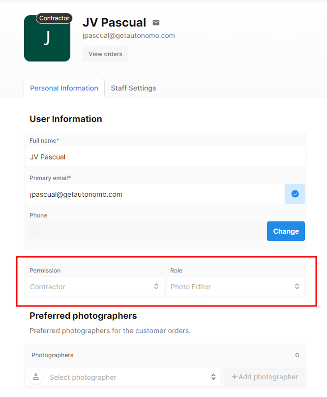
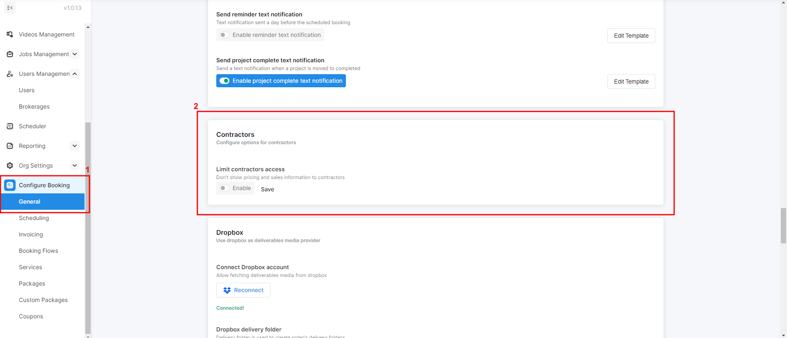
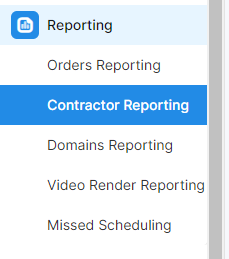
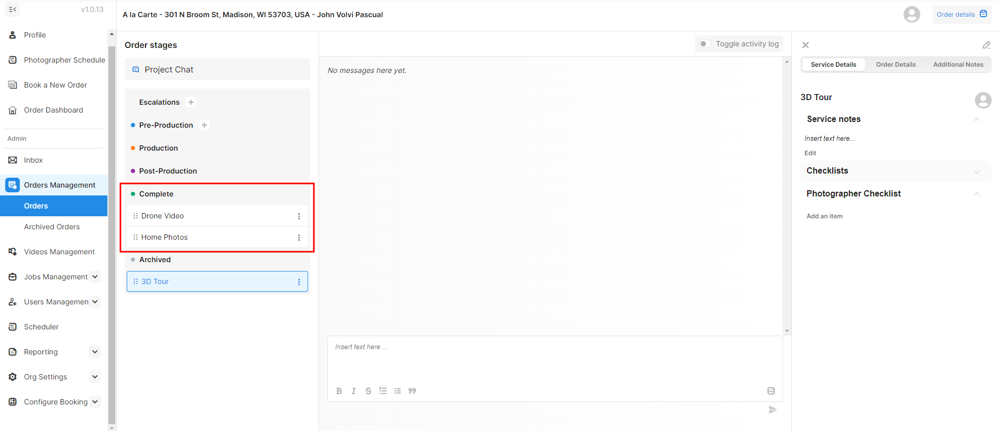

# Contractor

## Contractor Access

As a third-party user, a contractor can view existing orders, engage in project chats, and make changes to the orders. However, they cannot change the order status or payment status. You have two options to configure the user's permission level.

1. Send an invitation directly to your team members' emails, specifying their permission level. This can be done under **Org Settings > Team**. They simply need to open the link provided in the email and follow this [documentation](../users/add-and-configure-your-users.md#adding-your-staff) for creating an account.
2. The alternative approach involves your team member initiating the account creation process initially. Afterwards, you can modify their permission level to Contractor. Refer to this [documentation](../users/add-and-configure-your-users.md#adding-your-staff) for comprehensive instructions.

Under **Users Management > Users**, you can change your team permission level. Additionally, you can specify their role from the following list:

* Project Manager
* Creative Specialist
* Photo Editor
* Video Editor
* Operations Coordinator
* Account Executive
* Customer Success
* Operations Specialist

<figure><figcaption></figcaption></figure>

Tonomo provides a feature to restrict a contractor's access solely to the orders assigned to them. This ensures they cannot view orders not assigned to them and won't have visibility into any invoice or sales details. To activate this, head over to **Configure Booking > General** and toggle it on under the Contractors section.

<figure><figcaption></figcaption></figure>

## Contractor Payout Reporting

Contractor Payout Reporting allows you to easily calculate what you owe your contractors and staff for their work. To access it, see **Contractor Reporting** under **Reporting**.

<figure><figcaption></figcaption></figure>

<figure><figcaption></figcaption></figure>

First, set a **Date Range**.&#x20;

Then, enter what percentage (%) of the travel fee you share with your contractors, and by default, it's 100%. But you could enter 90%, for example, to share with them 90% of the travel fee while you retain 10%.&#x20;

Displayed in the table are all staff members with a **calendar connected**. This means that editors or project managers who are assigned to an order but don't have a calendar connected won't appear.

Next, **Service Status** is what Service status you want to appear in the report. You may not be using our feature to manage the statuses of individual services per order. So if you are not, then you will want to check all statuses except Archive so that we can give credit to photographers for all orders.

<figure><figcaption></figcaption></figure>


In it's current form, Contractor Payout Reporting double counts orders with more than one photographer. Meaning, if two photographers are on an order with a Completed Service, we will assign the full $ value of that order to **both** photographers.


You can also download this report to Excel in the top-right corner.
