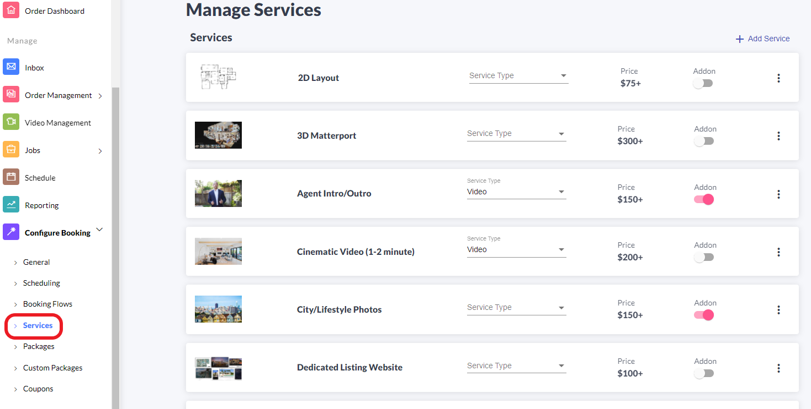

# Services

Services are why your customers are looking to hire you! Examples of Services are Home Photos, 3D Scans, Aerial Video, or whatever else your agency can provide. Of course, we aren't just going to throw a big list at the Agents looking to book with you. We will help you present your offerings in the best light to drive sales.

As with all of our setup steps, the goal isn't pixel perfection on the first go. We're going to get started with the significant components and refine them over time.


You'll notice we skip over some components of the Services in this guide. This is intentional to focus on the essentials and get your team using Tonomo. We'll provide more guidance later on refining your Services.


To get started, navigate to the **Services** section under **Configure Booking.**

## Core Service vs. Add-On

We allow you to add two distinct types of Services: Core Services and Add-Ons.&#x20;

* **Core Service** is something like a 30 Second Highlight Video. It's a standalone service that someone could order on its own and get a finished product.&#x20;
* **Add-On** is something like Virtual Staging, which would be an upsell or custom option for Home Photos. Virtual Staging isn't something you can do _without_ the Home Photos, so it is an Add-On  instead of a Core Service.

Here are some more examples of the differences between **Core Service** and **Add-On**.

|        Core Service       |            Add-On           |
| :-----------------------: | :-------------------------: |
|           Photos          |       Virtual Staging       |
|         2D Layout         |    Illustrated 2D Layout    |
| 30 Second Highlight Video | 15 Second Agent Intro/Outro |

As you can imagine, some of the difference is a matter of preference. For you, perhaps you would only do 2D Layouts if someone is ordering 3D Matterport. Then you would make 2D Layout an Add-On as opposed to a Core Service.


Haven't planned out your Services and Packages clearly yet? We put together a worksheet to help organize your offerings. [Click here](https://docs.google.com/spreadsheets/d/1c2vVPqlPNtxyQdpajiHt6XDEUmo7qkhB9Gr-7tdsK-0/edit?usp=sharing) to access it, log into your Google Account and then click **File** > **Make Copy** in the top left corner. If you don't have Google, copy/paste to Excel.\
\
The first spreadsheet is an **example** and the second is a **worksheet** for you to fill out.


## Adding Services

Whether you're adding a Core Service or an Add-On, the setup is the same, with a few tweaks at the end for Add-Ons. First, expand the Category for the Service you want to add and then click **+ Add Service**. This will take you to a new window with quite a few options. Let's break that down.

<figure><figcaption></figcaption></figure>

### General Information

First, configure the general information for your Service. This includes a thumbnail, title, description, and price. Below is a visual of what this information looks like to the booking Agent.

Our thumbnails for Services are 190x127. We recommend a resolution of 1280x850.

The **Price** field is only used for Services with [Custom Tiers.](services.md#undefined)

For the **Description**, we recommend only one short sentence. It should be just enough to differentiate it from other Services without turning your booking process into a wall of text.

Here's an example of a well-configured Services page. It provides enough content to clarify the Services without overwhelming the Agent.

### Additional Service Details

To enhance the presentation of your Services, we support a number of Additional Service Details that are appropriate for one kind of Service or another. To learn more about this, please refer to this [section](additional-service-details.md).

### Pricing Tiers

Scrolling down, we can specify the price for every tier.

Enter the price for every Tier. This information will inform the Order Management and Reporting features. Click **Save** at the bottom when you're done.


These are the Tiers we set in the [Displaying your Pricing](displaying-your-pricing.md#dynamic-pricing) guide. If you need to revisit these, click that blue **Edit** button next to "Tiers" and return when you're done!



If you want the price to be the same regardless of the size of the home (like perhaps for Lifestyle Photos), just enter the same dollar amount in each tier.


#### Custom Tiers without Using the Sq Ft

You'll notice the **Use custom tiers** toggle there. This is an option for you to customize the pricing for a specific Service that isn't based on Sq Ft. For example, you may use that toggle to display different prices for different numbers of photos. That looks like this in the booking process:

And this is how you configure that offering on the Services page:

<figure><figcaption></figcaption></figure>

Their **Tier Names** are the number of photos in that Tier, then the price for each Tier, the number of hours needed to schedule that Service. In this case, the hours were the same, but you can adjust that per tier.


The **Tier Price** is _in addition_ to the default price you set when you created the service. So if the price you set under the name of the Service was $25 and the user selects 2 Photos, they'll be charged $50.00.

Always click "Save" once editing is done.


#### Custom Tiers Using the Sq Ft

This is an option for you to customize the pricing for a specific Service that is based on Sq Ft. For example, you may use that toggle to display different prices for 3D Matterport depending on Sq Ft. That looks like this in the booking process:

<figure><figcaption>
Booked for 1,000 Sq Ft
</figcaption></figure>

<figure><figcaption>
Booked for 2,600 Sq ft
</figcaption></figure>

And this is how you configure that offering on the Services page:

<figure><figcaption>
Sample Custom Tier 
</figcaption></figure>

This **custom tier** method allows you to create a unique tier name (see sample above) and input the square footage range for that specific tier. You can also set the tier prices, payout, and scheduling. For example, if a customer booked 1,000 Sq ft, it will only show the specific tier for that Sq ft range and booked 2,600 Sq ft for another sample. Also, if you want to remove the limit, just leave the "Area to" blank and the system will read it as infinity.


The **Tier Price** is _in addition_ to the default price you set when you created the service. So if the price you set under the name of the Service was $600 and the user selects 3D Matterport w/ Floor plan at 2,501 Sq Ft to 5,000 Sq Ft range, they'll be charged $750.00.

Always click "Save" Once editing is done.


### Scheduling Tiers

Tonomo includes advanced Scheduling features, allowing Agents to book the time(s) that work for them before they complete the booking. This informs and expedites the project management process. For each Service, you need to specify how long your employee(s) will spend on-site with the agent. This does not include the time spent editing or managing the project.

Click each Tier and enter the number of hours you estimate each tier will need. As always, you can adjust this information at a later time. Make sure to hit **Save** when you're done!

Click the purple **+ Add Service** button at the bottom center of the page.

### Contractor Payout

**Tier Payout** is how much you want to pay each employee for completing that Service or Package per tier.

### Service Type

The final step that must be done for all Services is to set the Service Type for the order. Navigate back to your list of Services and then under the Service Type dropdown, select the appropriate option. If you're missing an option you need, let us know!\
\
This setting enables our Dropbox integration to perform properly.

<figure><figcaption></figcaption></figure>

### Set Skillsets


Failure to complete this step will mean Agents cannot book these Services.


Navigate to **Configure Booking > Scheduling,** scroll down to your Services table, and find the new Services. Check the box for any Staff member that can complete these new Services.

## Add-Ons

Once you've added all of your Services, configure Tonomo to know which of them are Add-Ons. Back on **Configure Booking** > **Services** on the left side of your screen, click the **Addon** toggle for one of your Add-Ons and then go into **Edit** again.

Some Add-Ons only make sense to add to certain kinds of Services. For example, you might want Agents to be able to select the Social Media Photos Add-On if they're purchasing Twilight Photos or Home Photos. If they're just buying a 2D layout, then they can't select Social Media Photos.

The Twilight Drone Photo Add-On has been tied to the Core Service called Twilight Photos in the below example.

## Don't Create a Delivery Folder

One of Tonomo's features is creating Dropbox folders for your delivery assets. If you don't want to create a separate folder for a Service, set the **Skip delivery folder creation** field to **Enable.**

<figure><figcaption></figcaption></figure>

This is common for a service like Twilight Photos where you are just going to include the Twilight Photos in the standard Home Photos folder instead of delivering them separately.&#x20;

## Videos

Video Services require one minor tweak. We handle video projects differently than photos in Tonomo because videos have a different workflow to complete the project. You'll notice that we have separate tabs for Order Management and Video Management on the left side of your screen.

We'll get into the precise differences later, but for now, it's enough to know that we handle videos differently than all other projects. So we want to inform Tonomo which Services are video-related.

Under **Configure Booking** and then **Services** again, there is a Service Type dropdown menu. Click that dropdown and select **Video** just for those Services that include video work. This will route all video orders to your video editors' workflow, which is separate from the workflow your other employees will be using.

## Misconfiguration Alert

You may see a red box highlighting a Service or Package, indicating some kind of alert.

<figure><figcaption></figcaption></figure>

This is notifying you that your Service or Package is misconfigured in some crucial way. Note: this will not alert you to ALL fields that are missing information, only those that may break booking in some way.\
\
We check for the following:

* [Price](services.md#general-information)
* [Pricing Tiers](services.md#pricing)
* [Scheduling Tiers](broken-reference)

