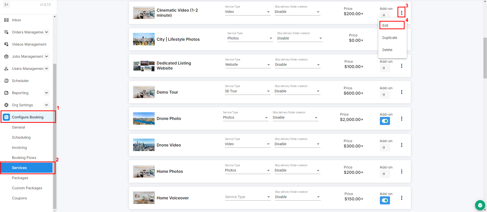
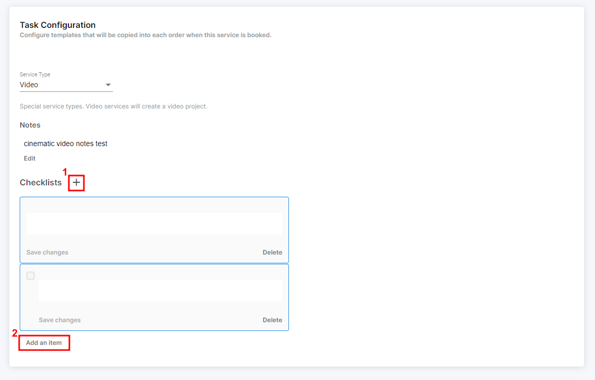

# Checklist Configuration

Within any given project, you've always been able to add and manage checklists to help keep your employees on task. These appear on the right side of the project page.

But if you've been manually creating the same checklist over and over, you can actually pre-configure a Service to pre-load a checklist into every project that includes that service. To get started, go into the **Edit** tab of one of your services.

<figure><figcaption></figcaption></figure>

Then, at the bottom of the page will be **Task Configuration** where you can click the **+** mark to create a new checklist and **add an item** to each checklist you've created. Feel free to add as many checklists as you need. These checklists then automatically appear in the Project details every time this Service is included in a Project.

<figure><figcaption></figcaption></figure>
