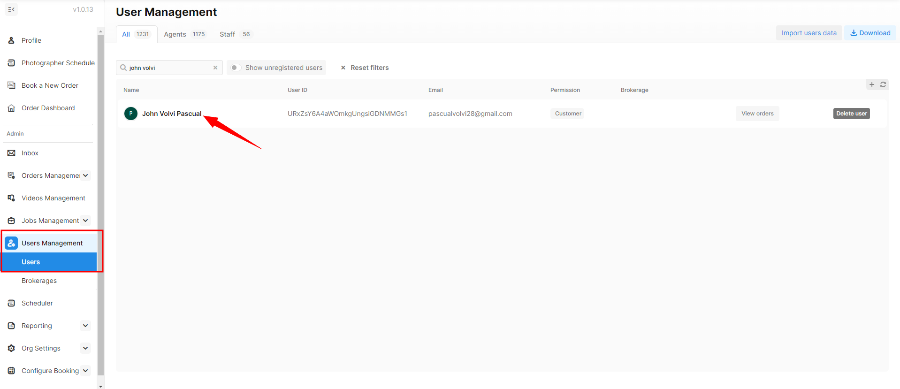
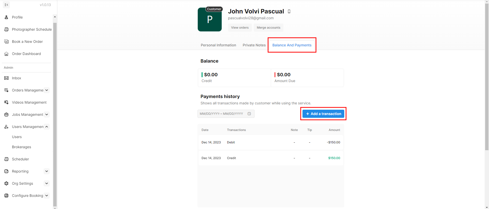
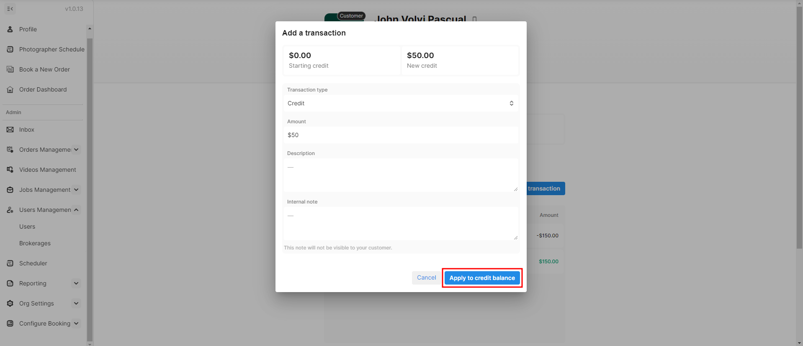
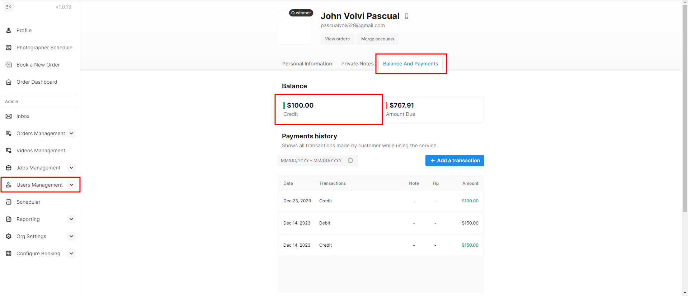
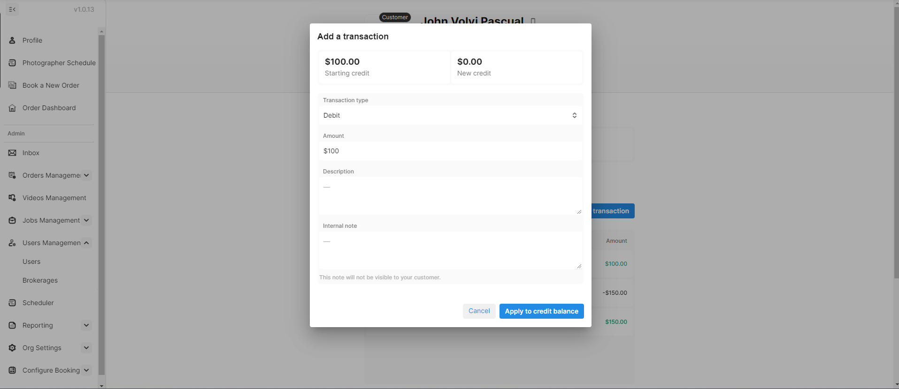
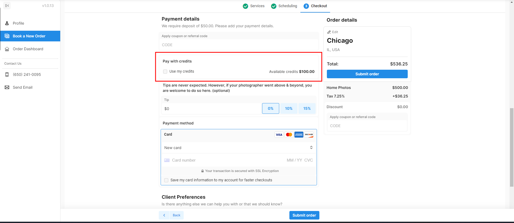

# Credit and Debit

Photographers have the option to include a transaction credit or debit for particular clients, intended for future use. This provides an alternative to issuing refunds, offering referral credits, or implementing promotions. Conversely, if clients have outstanding credits awaiting application and their payment is still pending, you have the ability to debit their balance accordingly.

## Adding Credit or Debit to a Customer’s Profile

To access this, navigate to the **Users Management > Users**. From there, choose the customer you wish to apply a credit/debit transaction to, proceed to their "**Balance and Payments**" tab, click on "**Add a transaction**," and opt for either **Credit** or **Debit**.

Step-by-step Instructions:

1. Head over to **User Management** and click the customer's name.

<figure><figcaption></figcaption></figure>

2. Within the customer's profile, locate the section labeled "**Balance and Payments.**" Upon clicking, you'll find a summary of their balance, including both credit and debit amounts, along with their payment history and referral code.

<figure><figcaption></figcaption></figure>

3. Choose "**Add a Transaction**" and opt for Credit or Debit. Input the Amount, provide a description detailing the reason for applying the credit/debit, and include an internal note visible only to you and your team. Finally, click on the "**Apply the credit balance**" button to complete the process.

<figure><figcaption></figcaption></figure>


Adding a debit transaction will deduct the amount from your credit balance.


## **Applying a Credit to an Order**

### As an Admin 

1. Go to User **Management > Users** and select your customer's profile. Make sure the customer has the appropriate credit balance.

<figure><figcaption></figcaption></figure>

2\. Select "Add a transaction", choose debit as the transaction type, and enter the amount. It will then deduct that debit from their credit balance.

<figure><figcaption></figcaption></figure>

3. After applying the debit to the customer's profile, go to Orders Management and choose the corresponding order to apply the credit then click "Change invoice".

<figure><figcaption></figcaption></figure>

4. Select discount as the type of item, flat discount as the type of payment, and then enter the client's credit that you deducted from his account on step 2. Lastly, click "Add" to finish.

<figure><figcaption></figcaption></figure>

### As an Agent 

1. Agents should follow the [Booking Flow Method](../order-management/creating-orders-for-your-customers.md#booking-flow-method):
   * Enter the property details.
   * Choose the desired services and/or packages.
   * Select the date and time slots.
   * Provide any necessary notes.
2. In the payment details section, agents can choose to utilize credits for payment. Simply mark the corresponding box, and the system will automatically apply the available credit. Finally, click on "**Submit order**" to complete the transaction.

<figure><figcaption></figcaption></figure>
