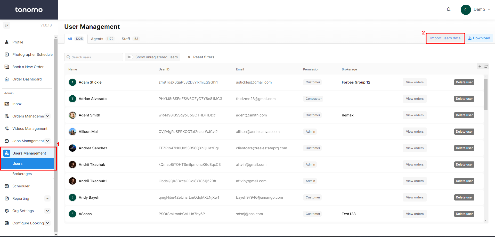

# Import Users

To import your customer list, follow these steps:

1. Navigate to Users Management > Users.
2. Click on "Import users data."
3. Ensure the imported data adheres to the following format:
   * **Include Header:** Please include the header when importing your Excel file.
   * **Save as CSV:** Save the Excel file as a CSV before importing.
   * **Blank Data:** If customer data is blank, leave it as is during the import process.
   * **Phone Numbers:** Ensure that phone numbers start with the country code.

Here is the link to the template you can use: [Customer List Import Template.](https://docs.google.com/spreadsheets/d/1E2CTTY0ihyv-\_MImETLK\_oG5Ne11wyI-\_hxCn\_0RJbI/edit#gid=917307322)

<figure><figcaption></figcaption></figure>
