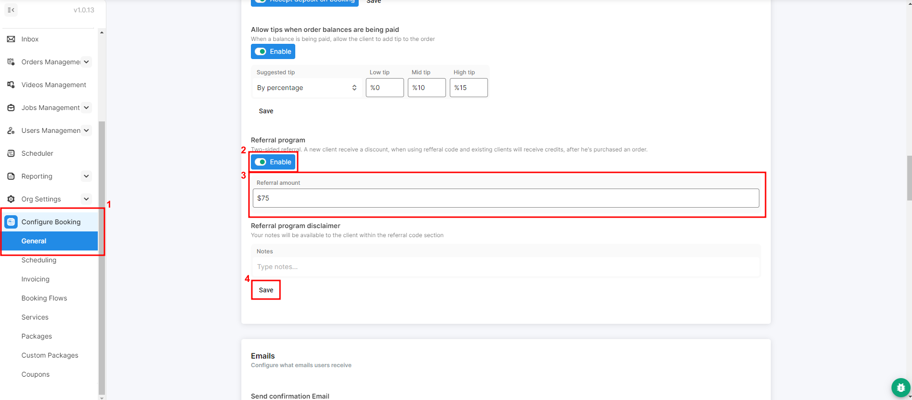

# Referrals



Our referral system allows your customers to earn $ credit to be applied to their account when other customers book using their unique code. Those new customers will also receive the same $ credit that the referrer did.


If you don't have the following features, reach out to Tonomo support and we can add it.


To get started, you will need to enable the feature and set the $ amount you want your referrals and referralers to earn. Go to **Configure Booking > General**, **Enable** the **Referral program,** type the referral amount, and hit **Save**. You and your customers can find your Referral Code in one of two places.

<figure><figcaption></figcaption></figure>

Next, your customers will need to get their referral codes. It's located under the **Balance and Payments** tab of their user Profile, accessible by clicking their profile in the top left corner.

<figure><figcaption></figcaption></figure>

Second, It's available via the Customer's Order Dashboard at the bottom.

<figure><figcaption></figcaption></figure>

The customer has the option to do these things to their code:

1. **Share Code Option**

* The customer has the option to share the referral code.
* Alternatively, they can click "Copy Code."

2. **Copy Code Option**

* Clicking "Copy Code" generates a link for the new customer.
* The referral code is automatically applied when the new customer follows the link.

3. **Manual Entry Option:**

* If the customer prefers, they can manually enter the code during the booking process.

<figure><figcaption></figcaption></figure>
