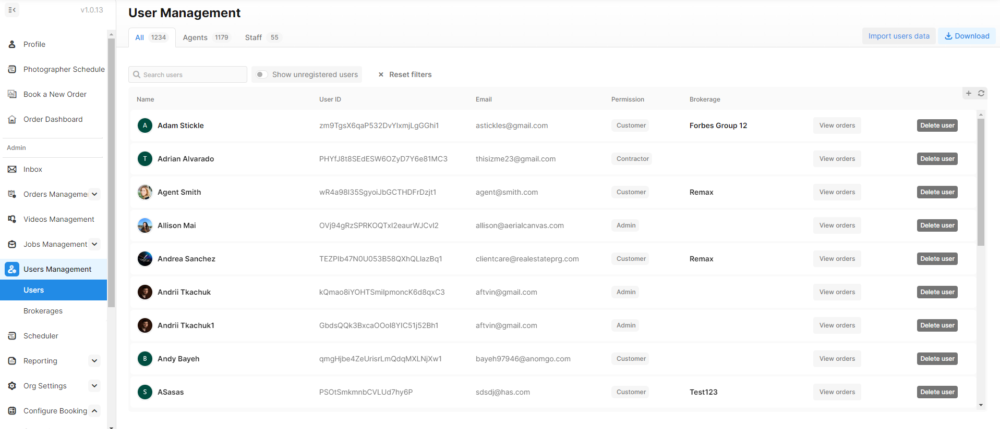
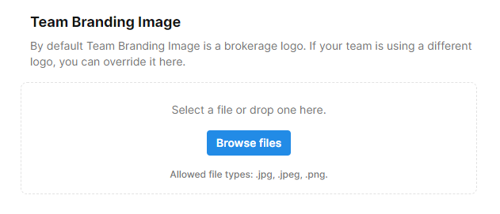
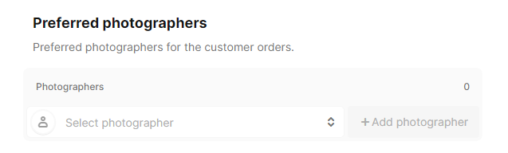
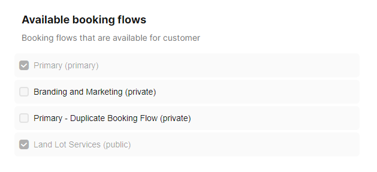
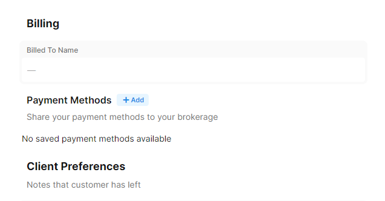
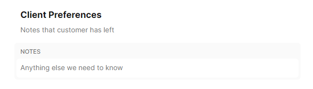
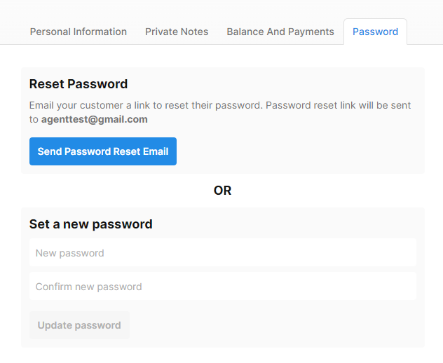
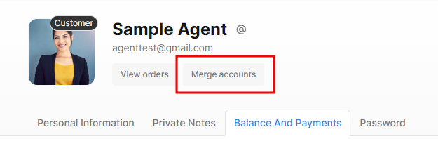

# User Data

After clicking User Management in the left hand corner of the portal, you will be directed to your list of Users, both Staff and Agents in the portal. From here, you can see a list of your Users as well as some simple filters:

<figure><figcaption></figcaption></figure>


If you'd like to change what columns appear on this page, click the small + box to the right of the column headers.


First, let's look at Agent Users. After opening an Agent User, at the top of the page will be your navigation. From here you can change the profile picture, get a shortcut to their orders, and Merge account. You can also navigate to the different portions of the User's profile:

<figure><figcaption></figcaption></figure>

## Personal Information

### User Information

From here, you can edit the contact information for the user, set their Brokerage (see [Brokerages Management](brokerages-management.md) for more information), and set their Permission level.

<figure><figcaption></figcaption></figure>

### Team Branding Image

Replace the current team branding image by uploading a new one or, alternatively, delete the uploaded image to revert to the existing team branding image.

<figure><figcaption></figcaption></figure>

### Additional Emails

You may also add, delete, or edit Additional emails. Any email addresses within this field will receive the same notification emails and calendar invites as the original ordering Agent. Orders will also appear on this person's dashboard should they create their own account.

.png>)

### Dedicated Staff Members

Dedicated Staff Members is for automatically assigning _back-end_ staff to your customer's orders. Note: this does _**not**_ assign a photographer. This is most typically used for assigning a specific Project Manager to a certain customer.

<figure><figcaption></figcaption></figure>

### Preferred Photographers

Choose an exclusive photographer for a particular customer. Upon the customer's booking, this designated photographer will be scheduled, subject to their availability.

<figure><figcaption></figcaption></figure>

### Preferred Method of Contact

The Preferred Method of Contact is purely for your organization. It does not change how Tonomo-generated notifications (like order confirmation and project complete emails) are sent.

.png>)

### Available Booking Flows

Designate the available booking flow for your customer. Even if a booking flow is marked as private, it will remain visible when checked under the customer's profile.

<figure><figcaption></figcaption></figure>

### Billing

#### Billed To Name

Input a preferred name to replace the existing profile name on the invoice.

#### Payment Methods

This functionality is available for any users within tonomo.

Saved Payment Methods refer to cards stored by a user that can be shared with their brokerage or admin. This also enables all members of the brokerage to utilize these saved payment methods in conjunction with their individually saved cards for order payments.

<figure><figcaption></figcaption></figure>

### Client Preferences

Client Preferences are **public** notes, meaning both the client and staff can see them. This is populated via a question during the booking process that the customer can fill out themselves. Alternatively, you can populate it for them with information they want to communicate on every order.

<figure><figcaption></figcaption></figure>

## Private Notes

In addition to Client Preferences, you can set Private Notes that the customer **cannot** see. This would be for communication about a customer that you need to make internally, but would prefer the customer not know about.

<figure><figcaption></figcaption></figure>


Currently, these notes do not appear on orders. They are only visible within User Management.


## Balance and Payments

Refer to the [Credit and Debit](credit-and-debit.md) documentation for detailed information on this feature.

## Password

You have the option to initiate a password reset email for your customer if required, or alternatively, you can set a new password on their behalf.

<figure><figcaption></figcaption></figure>

## View Orders

This will redirect you to the Order Dashboard, providing a comprehensive view of both your past and upcoming orders.

<figure><figcaption></figcaption></figure>

## Merge Accounts

You can merge two or more accounts for your client by clicking **Merge Accounts**.

<figure><figcaption></figcaption></figure>

Please watch this video walkthrough for more information.


